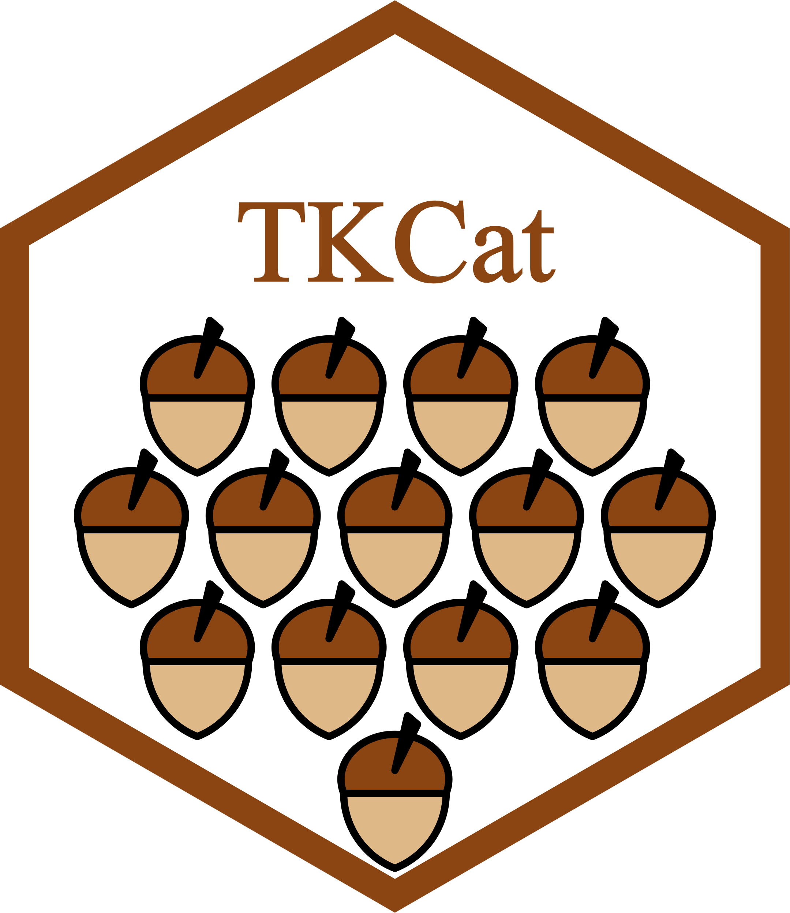
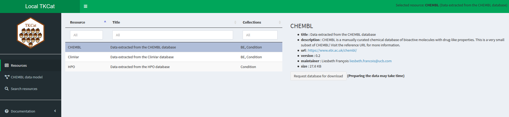

# Introduction to TKCat



## Introduction

Research organizations generate, manage, and use more and more knowledge
resources which can be highly heterogenous in their origin, their scope,
and their structure. Making this knowledge compliant to F.A.I.R.
(Findable, Accessible, Interoperable, Reusable) principles is critical
for facilitating the generation of new insights leveraging it. The aim
of the TKCat (Tailored Knowledge Catalog) R package is to facilitate the
management of such resources that are frequently used alone or in
combination in research environments.

In TKCat, knowledge resources are manipulated as modeled database (MDB)
objects. These objects provide access to the data tables along with a
general description of the resource and a detail data model generated
with [ReDaMoR](https://patzaw.github.io/ReDaMoR/) documenting the
tables, their fields and their relationships. These MDB are then
gathered in catalogs that can be easily explored an shared. TKCat
provides tools to easily subset, filter and combine MDBs and create new
catalogs suited for specific needs.

Currently, there are 3 different implementations of MDBs which are
supported by TKCat: in R memory (memoMDB), in files (fileMDB) and in
[ClickHouse](https://clickhouse.com/) (chMDB).

This is document is divided in four main sections:

- The first one describes how to build an MDB object, starting with a
  minimal example

- The second section shows how to interact with MDB objects to extract
  and combine information of interest

- The third section focuses on the use of the
  [ClickHouse](https://clickhouse.com/) implementation of MDB (chMDB)

- The fourth section corresponds to appendices providing technical
  information regarding [ClickHouse](https://clickhouse.com/) related
  admin tasks and the implementation of *collections* which are used to
  identify and leverage potential relationships between different MDBs.

## Create an MDB: a minimal example

This section shows how to create an MDB object starting from a set of
tables in three steps:

- Create a data model
- Create and validate a modeled database (MDB) by binding the data model
  to the dataset
- Document concept collections that can be used to make bridges across
  different MDBs

This example focuses on the [Human Phenotype Ontology (HPO)](#hpo). The
HPO aims to provide a standardized vocabulary of phenotypic
abnormalities encountered in human diseases ([Köhler et al.
2019](#ref-kohler_expansion_2019)).

### Loading example data

A subset of the HPO is provided within the
[ReDaMoR](https://patzaw.github.io/ReDaMoR/) package. We can read some
of the tables as follow:

``` r

library(readr)
hpo_data_dir <- system.file("examples/HPO-subset", package="ReDaMoR")
```

The `HPO_hp` table gathers human phenotype identifiers, names and
descriptions:

``` r

HPO_hp <- readr::read_tsv(
   file.path(hpo_data_dir, "HPO_hp.txt")
)
HPO_hp
```

    ## # A tibble: 500 × 4
    ##    id      name                                              description   level
    ##    <chr>   <chr>                                             <chr>         <dbl>
    ##  1 0000002 Abnormality of body height                        Deviation fr…     3
    ##  2 0000009 Functional abnormality of the bladder             Dysfunction …     6
    ##  3 0000014 Abnormality of the bladder                        An abnormali…     5
    ##  4 0000017 Nocturia                                          Abnormally i…     7
    ##  5 0000019 Urinary hesitancy                                 Difficulty i…     7
    ##  6 0000021 Megacystis                                        Dilatation o…     8
    ##  7 0000022 Abnormality of male internal genitalia            An abnormali…     6
    ##  8 0000024 Prostatitis                                       The presence…     8
    ##  9 0000025 Functional abnormality of male internal genitalia NA                6
    ## 10 0000030 Testicular gonadoblastoma                         The presence…     9
    ## # ℹ 490 more rows

The `HPO_diseases` table gathers disease identifiers and labels from
different disease database.

``` r

HPO_diseases <- readr::read_tsv(
   file.path(hpo_data_dir, "HPO_diseases.txt")
)
HPO_diseases
```

    ## # A tibble: 1,903 × 3
    ##    db           id label                                                        
    ##    <chr>     <dbl> <chr>                                                        
    ##  1 DECIPHER     15 NF1-microdeletion syndrome                                   
    ##  2 DECIPHER     45 Xq28 (MECP2) duplication                                     
    ##  3 DECIPHER     65 ATR-16 syndrome                                              
    ##  4 OMIM     100050 AARSKOG SYNDROME, AUTOSOMAL DOMINANT                         
    ##  5 OMIM     100650 ALDEHYDE DEHYDROGENASE 2 FAMILY                              
    ##  6 OMIM     101800 ACRODYSOSTOSIS 1, WITH OR WITHOUT HORMONE RESISTANCE; ACRDYS1
    ##  7 OMIM     102500 HAJDU-CHENEY SYNDROME; HJCYS                                 
    ##  8 OMIM     102510 ACROPECTOROVERTEBRAL DYSPLASIA, F-FORM OF                    
    ##  9 OMIM     102700 SEVERE COMBINED IMMUNODEFICIENCY, AUTOSOMAL RECESSIVE, T CEL…
    ## 10 OMIM     102800 ADENOSINE TRIPHOSPHATASE DEFICIENCY, ANEMIA DUE TO           
    ## # ℹ 1,893 more rows

The `HPO_diseaseHP` table indicates which phenotype is triggered by each
disease.

``` r

HPO_diseaseHP <- readr::read_tsv(
   file.path(hpo_data_dir, "HPO_diseaseHP.txt")
)
HPO_diseaseHP
```

    ## # A tibble: 2,594 × 3
    ##    db           id hp     
    ##    <chr>     <dbl> <chr>  
    ##  1 ORPHA    140976 0000002
    ##  2 ORPHA       432 0000002
    ##  3 DECIPHER     45 0000009
    ##  4 OMIM     300076 0000009
    ##  5 ORPHA    100996 0000009
    ##  6 ORPHA    100997 0000009
    ##  7 ORPHA      2571 0000009
    ##  8 ORPHA    391487 0000009
    ##  9 ORPHA    488594 0000009
    ## 10 ORPHA     71211 0000009
    ## # ℹ 2,584 more rows

### Creating a data model with ReDaMoR

The [ReDaMoR](https://patzaw.github.io/ReDaMoR/) package can be used for
drafting a data model from a set of table:

``` r

mhpo_dm <- ReDaMoR::df_to_model(HPO_hp, HPO_diseases, HPO_diseaseHP)
if(igraph_available){
   mhpo_dm %>%
      ReDaMoR::auto_layout(lengthMultiplier=80) %>% 
      plot()
}else{
   mhpo_dm %>%
      plot()
}
```

This data model is minimal: only the name of the tables, their fields
and their types are documented. There is no additional constrain
regarding the uniqueness or the completeness of the fields. Also there
is no information regarding the relationships between the different
tables. The
[`model_relational_data()`](https://patzaw.github.io/ReDaMoR/reference/model_relational_data.html)
can be used to improve the documentation of the dataset according to
what we know about it. This function raises a graphical interface for
manipulating and modifying the data model (see [ReDaMoR
documentation](https://patzaw.github.io/ReDaMoR/articles/ReDaMoR.html)).

``` r

mhpo_dm <- ReDaMoR::model_relational_data(mhpo_dm)
```

Below is the model we get after completing it using the function above.

``` r

plot(mhpo_dm)
```

In this model, we can see that:

- *id* is the **primary key** of the *HPO_hp* table, and therefore this
  field must be **unique**;
- *db*/*id* form the **primary key** of the *HPO_diseases* table and
  must also be **unique** when taken together;
- all the fields excepted *description* (in the *HPO_hp* table) are
  complete (they cannot be NA);
- the *HPO_diseaseHP* table refers to the *HPO_hp* table using its
  *HPO_hp* fields and to the *HPO_diseases* table using its *db* and
  *id* fields (such details are shown when putting cursor over the
  edges).

Moreover, some comments are added at the table and at the field level to
give a better understanding of the data (shown when putting the cursor
over the tables).

### Binding the model to the data in an MDB object

The data model can be explicitly bound to the data in an MDB (Modeled
DataBase) object as shown below. However, when trying to build the
object with the tables we’ve read and the data model we have edited, we
get the following error message.

``` r

mhpo_db <- memoMDB(
   dataTables=list(
      HPO_hp=HPO_hp, HPO_diseases=HPO_diseases, HPO_diseaseHP=HPO_diseaseHP
   ),
   dataModel=mhpo_dm,
   dbInfo=list(name="miniHPO")
)
```

#### miniHPO

FAILURE

##### Check configuration

- **Optional checks**: unique, not nullable, foreign keys
- **Maximum number of records**: Inf

##### HPO_hp

FAILURE

###### Field issues or warnings

- description: SUCCESS Missing values 117/500 = 23%
- level: FAILURE Unexpected “numeric”

##### HPO_diseases

FAILURE

###### Field issues or warnings

- id: FAILURE Unexpected “numeric”

##### HPO_diseaseHP

FAILURE

###### Field issues or warnings

- id: FAILURE Unexpected “numeric”

Indeed, according to the edited model (not the very first one
automatically created by ReDaMoR), the `HPO_hp$level` field should
contain *integer* values and the `HPO_diseases$id` and
`HPO_diseaseHP$id` fields should contain *character* values. The type of
the data is among the data model features that are automatically checked
when building an MDB object (along with uniqueness or NA values for
example).

To avoid this error, we can either change the type of the columns of the
data tables:

``` r

HPO_hp <- mutate(HPO_hp, level=as.integer(level))
HPO_diseases <- mutate(HPO_diseases, id=as.character(id))
HPO_diseaseHP <- mutate(HPO_diseaseHP, id=as.character(id))
mhpo_db <- memoMDB(
   dataTables=list(
      HPO_hp=HPO_hp, HPO_diseases=HPO_diseases, HPO_diseaseHP=HPO_diseaseHP
   ),
   dataModel=mhpo_dm,
   dbInfo=list(name="miniHPO")
)
```

Or we can use the data model to read the data in a fileMDB object:

``` r

f_mhpo_db <- read_fileMDB(
   path=hpo_data_dir,
   dbInfo=list(name="miniHPO"),
   dataModel=mhpo_dm
)
```

    ## miniHPO
    ## SUCCESS
    ## 
    ## Check configuration
    ##    - Optional checks: 
    ##    - Maximum number of records: 10

The
[`read_fileMDB()`](https://patzaw.github.io/TKCat/reference/read_fileMDB.md)
function identifies the text files to read in `path` according to the
`dataModel`. It uses the types documented in the data model to read the
files. By default, the field delimiter is `\t`, but another can be
defined by writing a `delim` slot in the `dbInfo` parameter
(e.g. `dbInfo=list(name="miniHPO", delim="\t")`).

As shown in the message above, by default,
[`read_fileMDB()`](https://patzaw.github.io/TKCat/reference/read_fileMDB.md)
does not perform optional checks (*unique* fields, *not nullable*
fields, *foreign keys*) and it only checks data on the 10 first records.
Also, the fileMDB data are not loaded in memory until requested by the
user. The object is then smaller than the memoMDB object even if they
gather the same information.

``` r

print(object.size(mhpo_db), units="Kb")
```

    ## 691.9 Kb

``` r

print(object.size(f_mhpo_db), units="Kb")
```

    ## 23.5 Kb

``` r

compare_MDB(former=mhpo_db, new=f_mhpo_db) %>% 
   DT::datatable(
      rownames=FALSE,
      width="75%",
      options=list(dom="t", pageLength=nrow(.))
   )
```

### Adding information about an MDB

In the table above we can see that several pieces of information are
expected in an MDB object even if not mandatory (*title*, *description*,
*url*, *version*, *maintainer*, *timestamp*). They can be provided in
the `dbInfo` parameter of the MDB creator function
(e.g. [`memoMDB()`](https://patzaw.github.io/TKCat/reference/memoMDB.md))
or added afterward:

- *title*, *description* and *url* are used to give more details about
  the scope of the data and their origin.

``` r

db_info(mhpo_db)$title <- "Very small extract of the human phenotype ontology"
db_info(mhpo_db)$description <- "For demonstrating ReDaMoR and TKCat capabilities, a very few information from the HPO (human phenotype ontology) has been extracted"
db_info(mhpo_db)$url <- "https://hpo.jax.org/"
```

- *version* and *maintainer* are related to db information and the data
  model whereas *timestamp* should be used to document the data
  themselves.

``` r

db_info(mhpo_db)$version <- "0.1"
db_info(mhpo_db)$maintainer <- "Patrice Godard"
db_info(mhpo_db)$timestamp <- Sys.time()
```

All this information is displayed when printing the object:

``` r

mhpo_db
```

    ## memoMDB miniHPO (version 0.1, Patrice Godard): Very small extract of the human phenotype ontology
    ##    - 3 tables with 10 fields
    ## 
    ## No collection member
    ## 
    ## For demonstrating ReDaMoR and TKCat capabilities, a very few information from the HPO (human phenotype ontology) has been extracted
    ## (https://hpo.jax.org/)
    ## 
    ## Timestamp: 2026-04-27 10:15:14.265807
    ## 

### Documenting collection members

In the HPO example, one table regards human phenotypes (*HPO_hp*) and
another human diseases (*HPO_diseases*). These concepts are general and
referenced in many other knowledge or data resources (e.g. database
providing information about disease genetics). Therefore, documenting
formally such concepts will help to identify how to connect the HPO
example to other resources referencing the same or related concepts.

In TKCat, these central concepts are referred as members of
*collections*. *Collections* are pre-defined and members must be
documented according to this definition. There are currently two
collections provided within the TKCat package:

``` r

list_local_collections()
```

    ## # A tibble: 2 × 2
    ##   title     description                                  
    ##   <chr>     <chr>                                        
    ## 1 BE        Collection of biological entity (BE) concepts
    ## 2 Condition Collection of condition concepts

Additional collections can be defined by users according to their needs.
Further information about collections implementation is provided in the
[appendix](#collections).

So far, there is no collection member documented in the HPO example
described above, as indicated by the *“No collection member”* statement
displayed when printing the object:

``` r

mhpo_db
```

    ## memoMDB miniHPO (version 0.1, Patrice Godard): Very small extract of the human phenotype ontology
    ##    - 3 tables with 10 fields
    ## 
    ## No collection member
    ## 
    ## For demonstrating ReDaMoR and TKCat capabilities, a very few information from the HPO (human phenotype ontology) has been extracted
    ## (https://hpo.jax.org/)
    ## 
    ## Timestamp: 2026-04-27 10:15:14.265807
    ## 

However, as just discussed, the *HPO_hp* table refers to human
phenotypes and the *HPO_diseases* table to human diseases. These concept
corresponds to conditions and those tables can be documented as member
of the *Condition* collection.

*Condition* members are documented calling the
[`add_collection_member()`](https://patzaw.github.io/TKCat/reference/add_collection_member.md)
function on the MDB object. The two other main arguments are the name of
the `collection` and the name of the `table` in the MDB object. The
other arguments to be provided depend on the collection. For *Condition*
members, three additional arguments must be provided:

- `condition` indicate the type of the condition (“Phenotype” or
  “Disease”)
- `source` a reference source of the condition identifier
- `identifier` a condition identifier

The functions
[`get_local_collection()`](https://patzaw.github.io/TKCat/reference/get_local_collection.md)
and
[`show_collection_def()`](https://patzaw.github.io/TKCat/reference/show_collection_def.md)
can be used together to identify valid arguments:

``` r

get_local_collection("Condition") %>%
   show_collection_def()
```

    ## Condition collection: Collection of condition concepts
    ## Arguments (non-mandatory arguments are between parentheses):
    ##    - condition:
    ##       + static: logical
    ##       + value: character
    ##    - source:
    ##       + static: logical
    ##       + value: character
    ##    - identifier:
    ##       + static: logical
    ##       + value: character

When calling
[`add_collection_member()`](https://patzaw.github.io/TKCat/reference/add_collection_member.md),
these arguments must be provided as a list with 2 elements named “value”
(a character) and “static” (a logical). If “static” is TRUE, “value”
corresponds to the information shared by all the rows of the table. If
“static” is FALSE, “value” indicates the name of the column which
provides this information for each row.

The example below shows how the *HPO_hp* table is documented as a member
of the *Condition* collection.

``` r

mhpo_db$HPO_hp
```

    ## # A tibble: 500 × 4
    ##    id      name                                              description   level
    ##    <chr>   <chr>                                             <chr>         <int>
    ##  1 0000002 Abnormality of body height                        Deviation fr…     3
    ##  2 0000009 Functional abnormality of the bladder             Dysfunction …     6
    ##  3 0000014 Abnormality of the bladder                        An abnormali…     5
    ##  4 0000017 Nocturia                                          Abnormally i…     7
    ##  5 0000019 Urinary hesitancy                                 Difficulty i…     7
    ##  6 0000021 Megacystis                                        Dilatation o…     8
    ##  7 0000022 Abnormality of male internal genitalia            An abnormali…     6
    ##  8 0000024 Prostatitis                                       The presence…     8
    ##  9 0000025 Functional abnormality of male internal genitalia NA                6
    ## 10 0000030 Testicular gonadoblastoma                         The presence…     9
    ## # ℹ 490 more rows

``` r

mhpo_db <- add_collection_member(
   mhpo_db, collection="Condition", table="HPO_hp",
   condition=list(value="Phenotype", static=TRUE),
   source=list(value="HP", static=TRUE),
   identifier=list(value="id", static=FALSE)
)
```

All rows in this table correspond to a condition of type “Phenotype”
(`condition=list(value="Phenotype", static=TRUE)`). The phenotype
identifiers are all taken from the same source, “HP”
(`source=list(value="HP", static=TRUE)`). The phenotype identifiers are
provided in the “id” column of the table
(`identifier=list(value="id", static=FALSE)`).

The example below shows how the *HPO_disease* table is documented also
as a member of the *Condition* collection. In this case, the source of
disease identifier can be different from one row to the other and is
provided in the “db” column (`source=list(value="db", static=FALSE)`).

``` r

mhpo_db <- add_collection_member(
   mhpo_db, collection="Condition", table="HPO_diseases",
   condition=list(value="Disease", static=TRUE),
   source=list(value="db", static=FALSE),
   identifier=list(value="id", static=FALSE)
)
```

Now, the existence of collection members is shown when printing the MDB
object:

``` r

mhpo_db
```

    ## memoMDB miniHPO (version 0.1, Patrice Godard): Very small extract of the human phenotype ontology
    ##    - 3 tables with 10 fields
    ## 
    ## Collection members: 
    ##    - 2 Condition members
    ## 
    ## For demonstrating ReDaMoR and TKCat capabilities, a very few information from the HPO (human phenotype ontology) has been extracted
    ## (https://hpo.jax.org/)
    ## 
    ## Timestamp: 2026-04-27 10:15:14.265807
    ## 

And the documented collection members of an MDB can be displayed as
following:

``` r

collection_members(mhpo_db)
```

    ## # A tibble: 6 × 9
    ##   collection cid                   resource   mid table field static value type 
    ##   <chr>      <chr>                 <chr>    <int> <chr> <chr> <lgl>  <chr> <chr>
    ## 1 Condition  miniHPO_Condition_1.0 miniHPO      1 HPO_… cond… TRUE   Phen… NA   
    ## 2 Condition  miniHPO_Condition_1.0 miniHPO      1 HPO_… sour… TRUE   HP    NA   
    ## 3 Condition  miniHPO_Condition_1.0 miniHPO      1 HPO_… iden… FALSE  id    NA   
    ## 4 Condition  miniHPO_Condition_1.0 miniHPO      2 HPO_… cond… TRUE   Dise… NA   
    ## 5 Condition  miniHPO_Condition_1.0 miniHPO      2 HPO_… sour… FALSE  db    NA   
    ## 6 Condition  miniHPO_Condition_1.0 miniHPO      2 HPO_… iden… FALSE  id    NA

The use of collection members to link or integrate different MDBs will
be described [later](#merging-with-collections) in this document

### Writing an MDB in files

Once an MDB has been created and documented in can be written in a
directory:

``` r

tmpDir <- tempdir()
as_fileMDB(mhpo_db, path=tmpDir, htmlModel=FALSE)
```

The structure of the created directory is the following:

    ## miniHPO                                         
    ##  ¦--data                                        
    ##  ¦   ¦--HPO_diseaseHP.txt.gz                    
    ##  ¦   ¦--HPO_diseases.txt.gz                     
    ##  ¦   °--HPO_hp.txt.gz                           
    ##  ¦--DESCRIPTION.json                            
    ##  °--model                                       
    ##      ¦--Collections                             
    ##      ¦   °--Condition-miniHPO_Condition_1.0.json
    ##      °--miniHPO.json

All the data are in the *data* folder whereas the data model and
collection members are written in json files in the *model* folder. The
*DESCRIPTION.json* file gather db information and information about how
to read the data files (i.e. `delim`, `na`).

This folder can be shared and it’s then easy to get all the data and the
corresponding documentation from it back in R:

``` r

read_fileMDB(file.path(tmpDir, "miniHPO"))
```

    ## miniHPO
    ## SUCCESS
    ## 
    ## Check configuration
    ##    - Optional checks: 
    ##    - Maximum number of records: 10

    ## fileMDB miniHPO (version 0.1, Patrice Godard): Very small extract of the human phenotype ontology
    ##    - 3 tables with 10 fields
    ## 
    ## Collection members: 
    ##    - 2 Condition members
    ## 
    ## For demonstrating ReDaMoR and TKCat capabilities, a very few information from the HPO (human phenotype ontology) has been extracted
    ## (https://hpo.jax.org/)
    ## 
    ## Timestamp: 2026-04-27 10:15:14
    ## 

Also writing these data and related information in text files make them
convenient to share with people using them in other analytical
environments than R.

## Leveraging MDB

The former section showed how to create and save an MDB object. This
section describes how MDBs can be used, filtered and combined to
efficiently leverage their content.

As a reminder, a modeled database (MDB) in TKCat gathers the following
information:

- General database information including a mandatory *name* and
  optionally the following fields: *title*, *description*, *url*,
  *version* and *maintainer*.
- A [ReDaMoR](https://patzaw.github.io/ReDaMoR/) data model.
- A list of tables corresponding to reference concepts shared by
  different MDBs. The way these concepts are identified is defined in
  specific documents called collections.
- The data themselves organized according to the data model.

### Loading example data

To illustrate how MDBs can be used, some example data are provided
within the [ReDaMoR](https://patzaw.github.io/ReDaMoR/) and the TKCat
package. The following paragraphs show how to load them in the R
session.

#### HPO

A subset of the [Human Phenotype Ontology (HPO)](https://hpo.jax.org/)
is provided within the [ReDaMoR](https://patzaw.github.io/ReDaMoR/)
package. The HPO aims to provide a standardized vocabulary of phenotypic
abnormalities encountered in human diseases ([Köhler et al.
2019](#ref-kohler_expansion_2019)). An MDB object based on files (see
[MDB implementations](#mdb-implementations)) can be read as shown below.
As explained above, the data provided by the `path` parameter are
documented with a model (`dataModel` parameter) and general information
(`dbInfo` parameter).

``` r

file_hpo <- read_fileMDB(
   path=system.file("examples/HPO-subset", package="ReDaMoR"),
   dataModel=system.file("examples/HPO-model.json", package="ReDaMoR"),
   dbInfo=list(
      "name"="HPO",
      "title"="Data extracted from the HPO database",
      "description"=paste(
         "This is a very small subset of the HPO!",
         "Visit the reference URL for more information."
      ),
      "url"="http://human-phenotype-ontology.github.io/"
   )
)
```

    ## HPO
    ## SUCCESS
    ## 
    ## Check configuration
    ##    - Optional checks: 
    ##    - Maximum number of records: 10

The message displayed in the console indicates if the data fit the data
model. It relies on the
[`ReDaMoR::confront_data()`](https://patzaw.github.io/ReDaMoR/reference/confront_data.html)
functions and check by default the first 10 rows of each file.

The data model can then be drawn.

``` r

plot(data_model(file_hpo))
```

The data model shows that this MDB contains the 3 tables taken into
account in the minimal example. The additional tables provides mainly
supplementary details regarding phenotype and diseases. Still, the
*HPO_hp* and the *HPO_disease* table are members of the *Condition*
collection and can be documented as such, as [explained
above](#min-coll-memb).

``` r

file_hpo <- file_hpo %>% 
   add_collection_member(
      collection="Condition", table="HPO_hp",
      condition=list(value="Phenotype", static=TRUE),
      source=list(value="HP", static=TRUE),
      identifier=list(value="id", static=FALSE)
   ) %>% 
   add_collection_member(
      collection="Condition", table="HPO_diseases",
      condition=list(value="Disease", static=TRUE),
      source=list(value="db", static=FALSE),
      identifier=list(value="id", static=FALSE)
   )
```

#### ClinVar

A subset of the [ClinVar](https://www.ncbi.nlm.nih.gov/clinvar/)
database is provided within this package. ClinVar is a freely
accessible, public archive of reports of the relationships among human
variations and phenotypes, with supporting evidence ([Landrum et al.
2018](#ref-landrum_clinvar_2018)). This resource can be read as a
`fileMDB` as shown above. However, in this case all the documenting
information is included in the resource directory, making it easier to
read as [explained above](#min-writing).

``` r

file_clinvar <- read_fileMDB(
   path=system.file("examples/ClinVar", package="TKCat")
)
```

    ## ClinVar
    ## SUCCESS
    ## 
    ## Check configuration
    ##    - Optional checks: 
    ##    - Maximum number of records: 10

``` r

file_clinvar
```

    ## fileMDB ClinVar (version 0.9, Patrice Godard <patrice.godard@ucb.com>): Data extracted from the ClinVar database
    ##    - 21 tables with 86 fields
    ## 
    ## Collection members: 
    ##    - 1 BE member
    ##    - 2 Condition members
    ## 
    ## ClinVar is a freely accessible, public archive of reports of the relationships among human variations and phenotypes, with supporting evidence. This is a very small subset of ClinVar! Visit the reference URL for more information.
    ## (https://www.ncbi.nlm.nih.gov/clinvar/)
    ## 
    ## 

#### CHEMBL

Similarly, a self-documented subset of the
[CHEMBL](https://www.ebi.ac.uk/chembl/) database is also provided in the
TKCat package. It can be read the same way.

``` r

file_chembl <- read_fileMDB(
   path=system.file("examples/CHEMBL", package="TKCat")
)
```

    ## CHEMBL
    ## SUCCESS
    ## 
    ## Check configuration
    ##    - Optional checks: 
    ##    - Maximum number of records: 10

CHEMBL is a manually curated chemical database of bioactive molecules
with drug-like properties ([Mendez et al.
2019](#ref-mendez_chembl_2019)).

``` r

file_chembl
```

    ## fileMDB CHEMBL (version 0.2, Liesbeth François <liesbeth.francois@ucb.com>): Data extracted from the CHEMBL database
    ##    - 10 tables with 61 fields
    ## 
    ## Collection members: 
    ##    - 1 BE member
    ##    - 1 Condition member
    ## 
    ## CHEMBL is a manually curated chemical database of bioactive molecules with drug-like properties. This is a very small subset of CHEMBL! Visit the reference URL for more information.
    ## (https://www.ebi.ac.uk/chembl/)
    ## 
    ## 

### MDB implementations

There are 3 main implementations of MDBs:

- **fileMDB** objects keep the data in files and load them only when
  requested by the user. These implementation is the first one which is
  used when reading MDB as demonstrated in the examples above.

- **memoMDB** objects have all the data loaded in memory. These objects
  are very easy to use but can take time to load and can use a lot of
  memory.

- **chMDB** objects get the data from a
  [ClickHouse](https://clickhouse.com/) database providing a catalog of
  MDBs as described in the [dedicated section](#chTKCat).

The different implementations can be converted to each others using
[`as_fileMDB()`](https://patzaw.github.io/TKCat/reference/as_fileMDB.md),
[`as_memoMDB()`](https://patzaw.github.io/TKCat/reference/as_memoMDB.md)
and [`as_chMDB()`](https://patzaw.github.io/TKCat/reference/as_chMDB.md)
functions.

``` r

memo_clinvar <- as_memoMDB(file_clinvar)
object.size(file_clinvar) %>% print(units="Kb")
```

    ## 155.2 Kb

``` r

object.size(memo_clinvar) %>% print(units="Kb")
```

    ## 760.5 Kb

A fourth implementation is **metaMDB** which combines several MDBs glued
together with relational tables (see the [Merging with
collections](#merging-with-collections) part).

Most of the functions described below work with any MDB implementation,
and a few functions are specific to each implementation.

### Exploring information

General information can be retrieved (and potentialy updated) using the
[`db_info()`](https://patzaw.github.io/TKCat/reference/db_info.md)
function.

``` r

db_info(file_clinvar)
```

    ## $name
    ## [1] "ClinVar"
    ## 
    ## $title
    ## [1] "Data extracted from the ClinVar database"
    ## 
    ## $description
    ## [1] "ClinVar is a freely accessible, public archive of reports of the relationships among human variations and phenotypes, with supporting evidence. This is a very small subset of ClinVar! Visit the reference URL for more information."
    ## 
    ## $url
    ## [1] "https://www.ncbi.nlm.nih.gov/clinvar/"
    ## 
    ## $version
    ## [1] "0.9"
    ## 
    ## $maintainer
    ## [1] "Patrice Godard <patrice.godard@ucb.com>"
    ## 
    ## $timestamp
    ## [1] NA

As shown above the data model of an MDB can be retrieved and plot the
following way.

``` r

plot(data_model(file_clinvar))
```

Tables names can be listed with the
[`names()`](https://rdrr.io/r/base/names.html) function and potentially
renamed with `names()<-` or
[`rename()`](https://dplyr.tidyverse.org/reference/rename.html)
functions (the tables have been renamed here to improve the readability
of the following examples).

``` r

names(file_clinvar)
```

    ##  [1] "ClinVar_ReferenceClinVarAssertion" "ClinVar_rcvaVariant"              
    ##  [3] "ClinVar_ClinVarAssertions"         "ClinVar_rcvaInhMode"              
    ##  [5] "ClinVar_rcvaObservedIn"            "ClinVar_rcvaTraits"               
    ##  [7] "ClinVar_clinSigOrder"              "ClinVar_revStatOrder"             
    ##  [9] "ClinVar_variants"                  "ClinVar_cvaObservedIn"            
    ## [11] "ClinVar_cvaSubmitters"             "ClinVar_traits"                   
    ## [13] "ClinVar_varEntrez"                 "ClinVar_varAttributes"            
    ## [15] "ClinVar_varCytoLoc"                "ClinVar_varNames"                 
    ## [17] "ClinVar_varSeqLoc"                 "ClinVar_varXRef"                  
    ## [19] "ClinVar_traitCref"                 "ClinVar_traitNames"               
    ## [21] "ClinVar_entrezNames"

``` r

file_clinvar <- file_clinvar %>% 
   set_names(sub("ClinVar_", "", names(.))) 
names(file_clinvar)
```

    ##  [1] "ReferenceClinVarAssertion" "rcvaVariant"              
    ##  [3] "ClinVarAssertions"         "rcvaInhMode"              
    ##  [5] "rcvaObservedIn"            "rcvaTraits"               
    ##  [7] "clinSigOrder"              "revStatOrder"             
    ##  [9] "variants"                  "cvaObservedIn"            
    ## [11] "cvaSubmitters"             "traits"                   
    ## [13] "varEntrez"                 "varAttributes"            
    ## [15] "varCytoLoc"                "varNames"                 
    ## [17] "varSeqLoc"                 "varXRef"                  
    ## [19] "traitCref"                 "traitNames"               
    ## [21] "entrezNames"

The different collection members of an MDBs are listed with the
[`collection_members()`](https://patzaw.github.io/TKCat/reference/collection_members.md)
function.

``` r

collection_members(file_clinvar)
```

    ## # A tibble: 10 × 9
    ##    collection cid                  resource   mid table field static value type 
    ##    <chr>      <chr>                <chr>    <int> <chr> <chr> <lgl>  <chr> <chr>
    ##  1 Condition  ClinVar_conditions_… ClinVar      2 trai… cond… TRUE   Dise… NA   
    ##  2 Condition  ClinVar_conditions_… ClinVar      2 trai… iden… FALSE  id    NA   
    ##  3 Condition  ClinVar_conditions_… ClinVar      2 trai… sour… TRUE   Clin… NA   
    ##  4 Condition  ClinVar_conditions_… ClinVar      1 trai… cond… TRUE   Dise… NA   
    ##  5 Condition  ClinVar_conditions_… ClinVar      1 trai… iden… FALSE  id    NA   
    ##  6 Condition  ClinVar_conditions_… ClinVar      1 trai… sour… FALSE  db    NA   
    ##  7 BE         ClinVar_BE_1.0       ClinVar      1 entr… be    TRUE   Gene  NA   
    ##  8 BE         ClinVar_BE_1.0       ClinVar      1 entr… iden… FALSE  entr… NA   
    ##  9 BE         ClinVar_BE_1.0       ClinVar      1 entr… orga… TRUE   Homo… Scie…
    ## 10 BE         ClinVar_BE_1.0       ClinVar      1 entr… sour… TRUE   Entr… NA

The following functions are use to get the number of tables, the number
of fields per table and the number of records.

``` r

length(file_clinvar)        # Number of tables
```

    ## [1] 21

``` r

lengths(file_clinvar)       # Number of fields per table
```

    ## ReferenceClinVarAssertion               rcvaVariant         ClinVarAssertions 
    ##                         8                         2                         4 
    ##               rcvaInhMode            rcvaObservedIn                rcvaTraits 
    ##                         2                         6                         3 
    ##              clinSigOrder              revStatOrder                  variants 
    ##                         2                         2                         3 
    ##             cvaObservedIn             cvaSubmitters                    traits 
    ##                         4                         3                         2 
    ##                 varEntrez             varAttributes                varCytoLoc 
    ##                         3                         5                         2 
    ##                  varNames                 varSeqLoc                   varXRef 
    ##                         3                        18                         4 
    ##                 traitCref                traitNames               entrezNames 
    ##                         4                         3                         3

``` r

count_records(file_clinvar) # Number of records per table
```

    ## ReferenceClinVarAssertion               rcvaVariant         ClinVarAssertions 
    ##                       166                       166                       409 
    ##               rcvaInhMode            rcvaObservedIn                rcvaTraits 
    ##                        16                       337                       166 
    ##              clinSigOrder              revStatOrder                  variants 
    ##                        11                         2                       138 
    ##             cvaObservedIn             cvaSubmitters                    traits 
    ##                       412                       416                        18 
    ##                 varEntrez             varAttributes                varCytoLoc 
    ##                       145                      2262                       138 
    ##                  varNames                 varSeqLoc                   varXRef 
    ##                       188                       280                       244 
    ##                 traitCref                traitNames               entrezNames 
    ##                        50                        44                        20

The
[`count_records()`](https://patzaw.github.io/TKCat/reference/count_records.md)
function can take a lot of time when dealing with *fileMDB* objects if
the data files are very large. In such case it could be more efficient
to list data file size instead.

``` r

data_file_size(file_clinvar, hr=TRUE)
```

    ## # A tibble: 21 × 3
    ##    table                     size   compressed
    ##    <chr>                     <chr>  <lgl>     
    ##  1 ReferenceClinVarAssertion 4.6 KB TRUE      
    ##  2 rcvaVariant               947 B  TRUE      
    ##  3 ClinVarAssertions         4.2 KB TRUE      
    ##  4 rcvaInhMode               152 B  TRUE      
    ##  5 rcvaObservedIn            1.4 KB TRUE      
    ##  6 rcvaTraits                788 B  TRUE      
    ##  7 clinSigOrder              145 B  TRUE      
    ##  8 revStatOrder              101 B  TRUE      
    ##  9 variants                  2.1 KB TRUE      
    ## 10 cvaObservedIn             1.8 KB TRUE      
    ## # ℹ 11 more rows

### Pulling, subsetting and combining

There are several possible ways to pull data tables from MDBs. The
following lines return the same result displayed below (only once).

``` r

data_tables(file_clinvar, "traitNames")[[1]]
file_clinvar[["traitNames"]]
file_clinvar$"traitNames"
file_clinvar %>% pull(traitNames)
```

    ## # A tibble: 44 × 3
    ##     t.id name                                                              type 
    ##    <int> <chr>                                                             <chr>
    ##  1   912 Chudley-McCullough syndrome                                       Pref…
    ##  2   912 Deafness, autosomal recessive 82                                  Alte…
    ##  3   912 Deafness, bilateral sensorineural, and hydrocephalus due to fora… Alte…
    ##  4   912 Deafness, sensorineural, with partial agenesis of the corpus cal… Alte…
    ##  5  1352 CTSD-Related Neuronal Ceroid-Lipofuscinosis                       Alte…
    ##  6  1352 Ceroid lipofuscinosis neuronal Cathepsin D-deficient              Alte…
    ##  7  1352 Neuronal ceroid lipofuscinosis 10                                 Pref…
    ##  8  1352 Neuronal ceroid lipofuscinosis due to Cathepsin D deficiency      Alte…
    ##  9  1481 Diabetes mellitus, neonatal, with congenital hypothyroidism       Pref…
    ## 10  1481 NDH SYNDROME                                                      Alte…
    ## # ℹ 34 more rows

MDBs can also be subset and combined. The corresponding functions ensure
that the data model is fulfilled by the data tables.

``` r

file_clinvar[1:3]
```

    ## fileMDB ClinVar (version 0.9, Patrice Godard <patrice.godard@ucb.com>): Data extracted from the ClinVar database
    ##    - 3 tables with 14 fields
    ## 
    ## No collection member
    ## 
    ## ClinVar is a freely accessible, public archive of reports of the relationships among human variations and phenotypes, with supporting evidence. This is a very small subset of ClinVar! Visit the reference URL for more information.
    ## (https://www.ncbi.nlm.nih.gov/clinvar/)
    ## 
    ## 

``` r

if(igraph_available){
   c(file_clinvar[1:3], file_hpo[c(1,5,7)]) %>% 
      data_model() %>% auto_layout(force=TRUE) %>% plot()
}else{
   c(file_clinvar[1:3], file_hpo[c(1,5,7)]) %>% 
      data_model() %>% plot()
}
```

The function [`c()`](https://rdrr.io/r/base/c.html) concatenates the
provided MDB after checking that tables names are not duplicated. It
does not integrate the data with any relational table. This can achieved
by merging the MDBs as described in the [Merging with
collections](#merging-with-collections) section.

### Filtering and joining

An MDB can be filtered by filtering one or several tables based on field
values. The filtering is propagated to other tables using the embedded
data model.

In the example below, the `file_clinvar` object is filtered in order to
focus on a few genes with pathogenic variants. The table below compares
the number of rows before (“ori”) and after (“filt”) filtering.

``` r

filtered_clinvar <- file_clinvar %>%
   filter(
      entrezNames = symbol %in% c("PIK3R2", "UGT1A8")
   ) %>% 
   slice(ReferenceClinVarAssertion=grep(
      "pathogen",
      .$ReferenceClinVarAssertion$clinicalSignificance,
      ignore.case=TRUE
   ))
left_join(
   dims(file_clinvar) %>% select(name, nrow),
   dims(filtered_clinvar) %>% select(name, nrow),
   by="name",
   suffix=c("_ori", "_filt")
)
```

    ## # A tibble: 21 × 3
    ##    name                      nrow_ori nrow_filt
    ##    <chr>                        <dbl>     <int>
    ##  1 ReferenceClinVarAssertion      166         4
    ##  2 rcvaVariant                    166         4
    ##  3 ClinVarAssertions              409        15
    ##  4 rcvaInhMode                     16         0
    ##  5 rcvaObservedIn                 337        10
    ##  6 rcvaTraits                     166         4
    ##  7 clinSigOrder                    11         3
    ##  8 revStatOrder                     2         1
    ##  9 variants                       138         3
    ## 10 cvaObservedIn                  412        15
    ## # ℹ 11 more rows

The object returned by
[`filter()`](https://dplyr.tidyverse.org/reference/filter.html) or
`slice` is a *memoMDB*: all the data are in memory.

Tables can be easily joined to get diseases associated to the genes of
interest in a single table as shown below.

``` r

gene_traits <- filtered_clinvar %>% 
   join_mdb_tables(
      "entrezNames", "varEntrez", "variants", "rcvaVariant",
      "ReferenceClinVarAssertion", "rcvaTraits", "traits"
   )
gene_traits$entrezNames %>%
   select(symbol, name, variants.type, variants.name, traitType, traits.name)
```

    ## # A tibble: 4 × 6
    ##   symbol name                  variants.type variants.name traitType traits.name
    ##   <chr>  <chr>                 <chr>         <chr>         <chr>     <chr>      
    ## 1 PIK3R2 phosphoinositide-3-k… single nucle… NM_005027.4(… Disease   Megalencep…
    ## 2 PIK3R2 phosphoinositide-3-k… single nucle… NM_005027.4(… Disease   not provid…
    ## 3 PIK3R2 phosphoinositide-3-k… single nucle… NM_005027.4(… Disease   not provid…
    ## 4 UGT1A8 UDP glucuronosyltran… Microsatelli… UGT1A1*28     Disease   Gilbert's …

### Merging MDBs with collections

Until now, we have seen how to use individual MDB by exploring general
information about it, extracting tables, filtering and joining data.
This part shows how to use **collections** to identify relationships
between MDBs and to leverage these relationships to integrate them.
Documenting collection members has been [described
above](#min-coll-memb) and further information about collections
implementation is provided in the [appendix](#collections).

#### Collections and collection members

As explained [above](#min-coll-memb), some databases refer to the same
concepts and could be integrated accordingly. However they often use
different vocabularies.

For example, both [CHEMBL](#chembl) and [ClinVar](#clinvar) refer to
biological entities (BE) for documenting drug targets or disease causal
genes. CHEMBL refers to drug target in the *CHEMBL_component_sequence*
table using mainly Uniprot peptide identifiers from different species.

``` r

file_chembl$CHEMBL_component_sequence
```

    ## # A tibble: 35 × 5
    ##    component_id accession organism                  db_source db_version
    ##           <int> <chr>     <chr>                     <chr>     <chr>     
    ##  1          259 P15260    Homo sapiens              Uniprot   2019_09   
    ##  2          327 Q99062    Homo sapiens              Uniprot   2019_09   
    ##  3          752 P35563    Rattus norvegicus         Uniprot   2019_09   
    ##  4          917 P07339    Homo sapiens              Uniprot   2019_09   
    ##  5         1807 Q54A96    Plasmodium falciparum     Uniprot   2019_09   
    ##  6         2180 P67774    Bos taurus                Uniprot   2019_09   
    ##  7         2398 P25098    Homo sapiens              Uniprot   2019_09   
    ##  8         2541 Q8II92    Plasmodium falciparum 3D7 Uniprot   2019_09   
    ##  9         3803 Q64346    Rattus norvegicus         Uniprot   2019_09   
    ## 10         4395 O60502    Homo sapiens              Uniprot   2019_09   
    ## # ℹ 25 more rows

Whereas ClinVar refers to causal genes in the *entrezNames* table using
human Entrez gene identifiers.

``` r

file_clinvar$entrezNames
```

    ## # A tibble: 20 × 3
    ##       entrez name                                                         symbol
    ##        <int> <chr>                                                        <chr> 
    ##  1      1509 cathepsin D                                                  CTSD  
    ##  2      1903 sphingosine-1-phosphate receptor 3                           S1PR3 
    ##  3      3300 DnaJ heat shock protein family (Hsp40) member B2             DNAJB2
    ##  4      3423 iduronate 2-sulfatase                                        IDS   
    ##  5      3910 laminin subunit alpha 4                                      LAMA4 
    ##  6      5296 phosphoinositide-3-kinase regulatory subunit 2               PIK3R2
    ##  7      6748 signal sequence receptor subunit 4                           SSR4  
    ##  8      7633 zinc finger protein 79                                       ZNF79 
    ##  9     22906 trafficking kinesin protein 1                                TRAK1 
    ## 10     23155 chloride channel CLIC like 1                                 CLCC1 
    ## 11     26251 potassium voltage-gated channel modifier subfamily G member… KCNG2 
    ## 12     29851 inducible T cell costimulator                                ICOS  
    ## 13     54576 UDP glucuronosyltransferase family 1 member A8               UGT1A8
    ## 14     57684 zinc finger and BTB domain containing 26                     ZBTB26
    ## 15    115948 outer dynein arm docking complex subunit 3                   ODAD3 
    ## 16    139716 GRB2 associated binding protein 3                            GAB3  
    ## 17    169792 GLIS family zinc finger 3                                    GLIS3 
    ## 18    407054 microRNA 98                                                  MIR98 
    ## 19    441531 phosphoglycerate mutase family member 4                      PGAM4 
    ## 20 105373557 serous ovarian cancer associated RNA                         SOCAR

Since peptides are coded by genes, there is a biological relationship
between these two types of BE, and several tools exist to convert such
BE identifiers from one scope to the other
(e.g. [BED](https://github.com/patzaw/BED) ([Godard and Eyll
2018](#ref-godard_bed:_2018)),
[mygene](https://bioconductor.org/packages/release/bioc/html/mygene.html)
([Wu et al. 2012](#ref-wu2012)),
[biomaRt](https://bioconductor.org/packages/release/bioc/html/biomaRt.html)
([Kinsella et al. 2011](#ref-kinsella2011))).

TKCat provides mechanism to document these scopes in order to allow
automatic conversions from and to any of them. Those concepts are called
**Collections** in TKCat and they should be formally defined before
being able to document any of their members. Two collection definitions
are provided within the TKCat package and other can be imported with the
[`import_local_collection()`](https://patzaw.github.io/TKCat/reference/import_local_collection.md)
function.

``` r

list_local_collections()
```

    ## # A tibble: 2 × 2
    ##   title     description                                  
    ##   <chr>     <chr>                                        
    ## 1 BE        Collection of biological entity (BE) concepts
    ## 2 Condition Collection of condition concepts

Here are the definition of the BE collection members provided by the
*CHEMBL_component_sequence* and the *entrezNames* tables.

``` r

collection_members(file_chembl, "BE")
```

    ## # A tibble: 4 × 9
    ##   collection cid           resource   mid table         field static value type 
    ##   <chr>      <chr>         <chr>    <int> <chr>         <chr> <lgl>  <chr> <chr>
    ## 1 BE         CHEMBL_BE_1.0 CHEMBL       1 CHEMBL_compo… be    TRUE   Pept… NA   
    ## 2 BE         CHEMBL_BE_1.0 CHEMBL       1 CHEMBL_compo… iden… FALSE  acce… NA   
    ## 3 BE         CHEMBL_BE_1.0 CHEMBL       1 CHEMBL_compo… sour… FALSE  db_s… NA   
    ## 4 BE         CHEMBL_BE_1.0 CHEMBL       1 CHEMBL_compo… orga… FALSE  orga… Scie…

``` r

collection_members(file_clinvar, "BE")
```

    ## # A tibble: 4 × 9
    ##   collection cid            resource   mid table       field  static value type 
    ##   <chr>      <chr>          <chr>    <int> <chr>       <chr>  <lgl>  <chr> <chr>
    ## 1 BE         ClinVar_BE_1.0 ClinVar      1 entrezNames be     TRUE   Gene  NA   
    ## 2 BE         ClinVar_BE_1.0 ClinVar      1 entrezNames ident… FALSE  entr… NA   
    ## 3 BE         ClinVar_BE_1.0 ClinVar      1 entrezNames organ… TRUE   Homo… Scie…
    ## 4 BE         ClinVar_BE_1.0 ClinVar      1 entrezNames source TRUE   Entr… NA

The *Collection* column indicates the collection to which the table
refers. The *cid* column indicates the version of the collection
definition which should correspond to the `$id` of JSON schema. The
*resource* column indicates the name of the resource and the *mid*
column an identifier which is unique for each member of a collection in
each resource. The *field* column indicates each part of the scope of
collection. In the case of BE, 4 fields should be documented:

- be: the type of BE (e.g. Gene or Peptide)
- source: the source of the identifier (e.g. EntrezGene or Peptide)
- organism: the organism to which the identifier refers (e.g Homo
  sapiens)
- identifier: the identifier itself.

Each of these fields can be *static* or not. `TRUE` means that the value
of this field is the same for all the records and is provided in the
*value* column. Whereas `FALSE` means that the value can be different
for each record and is provided in the column the name of which is given
in the *value* column. The *type* column is only used for the organism
field in the case of the BE collection and can take 2 values:
“Scientific name” or “NCBI taxon identifier”. The definition of the
pre-build BE collection members follows the terminology used in the [BED
package](https://github.com/patzaw/BED) ([Godard and Eyll
2018](#ref-godard_bed:_2018)). But it can be adapted according to the
solution chosen for converting BE identifiers from one scope to another.

Setting up the definition of such scope is done using the
[`add_collection_member()`](https://patzaw.github.io/TKCat/reference/add_collection_member.md)
function as shown above in the [minimal example](#min-coll-memb) and in
the [Reading HPO example](#hpo).

#### Shared collections and merging

The aim of collections is to identify potential bridges between MDBs.
The `get_shared_collection()` function is used to list all the
collections shared by two MDBs.

``` r

get_shared_collections(filtered_clinvar, file_chembl)
```

    ## # A tibble: 3 × 5
    ##   collection table.x     mid.x table.y                   mid.y
    ##   <chr>      <chr>       <int> <chr>                     <int>
    ## 1 Condition  traits          2 CHEMBL_drug_indication        1
    ## 2 Condition  traitCref       1 CHEMBL_drug_indication        1
    ## 3 BE         entrezNames     1 CHEMBL_component_sequence     1

In this example, there are 3 different ways to merge the two MDBs
*filtered_clinvar* and *file_chembl*:

- Based on conditions provided respectively in the *traits* and in the
  *CHEMBL_drug_indication* tables
- Based on conditions provided respectively in the *traitsCref* and in
  the *CHEMBL_drug_indication* tables
- Based on BE provided respectively in the *entrezNames* and in the
  *CHEMBL_component_sequence* tables

The code below shows how to merge these two resources based on BE
information. To achieve this task it relies on a function provided with
TKCat along with BE collection definition (to get the function:
`get_collection_mapper("BE")`). This function uses the [BED
package](https://github.com/patzaw/BED) ([Godard and Eyll
2018](#ref-godard_bed:_2018)) and you need this package to be installed
with a connection to BED database in order to run the code below.

``` r

try(BED::connectToBed(a))
```

    ## Error in eval(expr, envir) : object 'a' not found

``` r

bedCheck <- try(BED::checkBedConn())
if(!inherits(bedCheck, "try-error") && bedCheck){
   sel_coll <- get_shared_collections(file_clinvar, file_chembl) %>% 
      filter(collection=="BE")
   filtered_cv_chembl <- merge(
      x=file_clinvar,
      y=file_chembl,
      by=sel_coll,
      dmAutoLayout=igraph_available
   )
}
```

The returned object is a **metaMDB** gathering the original MDBs and a
relational table between members of the same collection as defined by
the `by` parameter.

Additional information about collection can be found below in the
[appendix](#collections).

#### Merging without collection

If the *collection* column of the `by` parameter is `NA`, then the
relational table is built by merging identical columns in table.x and
table.y (No conversion occurs). For example, *file_hpo* and
*file_clinvar* MDBs could be merged according to conditions provided in
the *HPO_diseases* and the *traitCref* tables respectively.

``` r

get_shared_collections(file_hpo, file_clinvar)
```

    ## # A tibble: 4 × 5
    ##   collection table.x      mid.x table.y   mid.y
    ##   <chr>      <chr>        <int> <chr>     <int>
    ## 1 Condition  HPO_hp           1 traits        2
    ## 2 Condition  HPO_hp           1 traitCref     1
    ## 3 Condition  HPO_diseases     2 traits        2
    ## 4 Condition  HPO_diseases     2 traitCref     1

These conditions could be converted using a function provided with TKCat
(`get_collection_mapper("Condition")`) and which rely on the [DODO
package](https://github.com/Elysheba/DODO) ([François et al.
2020](#ref-fran%C3%A7ois2020)). The two tables can also be simply
concatenated without applying any conversion (loosing the advantage of
such conversion obviously).

``` r

sel_coll <- get_shared_collections(file_hpo, file_clinvar) %>% 
   filter(table.x=="HPO_diseases", table.y=="traitCref") %>% 
   mutate(collection=NA)
sel_coll
```

    ## # A tibble: 1 × 5
    ##   collection table.x      mid.x table.y   mid.y
    ##   <lgl>      <chr>        <int> <chr>     <int>
    ## 1 NA         HPO_diseases     2 traitCref     1

The [`merge()`](https://rdrr.io/r/base/merge.html) function gather the
two *MDBs* in one *metaMDB* and create a association table based on the
`by` argument. This association table (“HPO_diseases_traitCref”) is
displayed in yellow in the data model of the created *metaMDB* as shown
below.

``` r

hpo_clinvar <- merge(
   file_hpo, file_clinvar, by=sel_coll, dmAutoLayout=igraph_available
)
plot(data_model(hpo_clinvar))
```

``` r

hpo_clinvar$HPO_diseases_traitCref
```

    ## # A tibble: 1,950 × 2
    ##    db       id    
    ##    <chr>    <chr> 
    ##  1 DECIPHER 15    
    ##  2 DECIPHER 45    
    ##  3 DECIPHER 65    
    ##  4 OMIM     100050
    ##  5 OMIM     100650
    ##  6 OMIM     101800
    ##  7 OMIM     102500
    ##  8 OMIM     102510
    ##  9 OMIM     102700
    ## 10 OMIM     102800
    ## # ℹ 1,940 more rows

## A centralized catalog of MDB in ClickHouse (chTKCat)

### Local TKCat

MDB can be gathered in a *TKCat* (Tailored Knowledge Catalog) object.

``` r

k <- TKCat(file_hpo, file_clinvar)
```

Gathering MDBs in such a catalog facilitate their exploration and their
preparation for potential integration. Several functions are available
to achieve this goal.

``` r

list_MDBs(k)                     # list all the MDBs in a TKCat object
```

    ## # A tibble: 2 × 7
    ##   name    title         description url   version maintainer timestamp
    ##   <chr>   <chr>         <chr>       <chr> <chr>   <chr>      <dttm>   
    ## 1 HPO     Data extract… This is a … http… NA      NA         NA       
    ## 2 ClinVar Data extract… ClinVar is… http… 0.9     Patrice G… NA

``` r

get_MDB(k, "HPO")                # get a specific MDBs from the catalog
```

    ## fileMDB HPO: Data extracted from the HPO database
    ##    - 9 tables with 25 fields
    ## 
    ## Collection members: 
    ##    - 2 Condition members
    ## 
    ## This is a very small subset of the HPO! Visit the reference URL for more information.
    ## (http://human-phenotype-ontology.github.io/)
    ## 
    ## 

``` r

search_MDB_tables(k, "disease")  # Search table about "disease"
```

    ## # A tibble: 3 × 3
    ##   resource name                comment                 
    ##   <chr>    <chr>               <chr>                   
    ## 1 HPO      HPO_diseases        Diseases                
    ## 2 HPO      HPO_diseaseHP       HP presented by diseases
    ## 3 HPO      HPO_diseaseSynonyms Disease synonyms

``` r

search_MDB_fields(k, "disease")  # Search a field about "disease"
```

    ## # A tibble: 8 × 7
    ##   resource table               name    type      nullable unique comment        
    ##   <chr>    <chr>               <chr>   <chr>     <lgl>    <lgl>  <chr>          
    ## 1 HPO      HPO_diseases        db      character FALSE    FALSE  Disease databa…
    ## 2 HPO      HPO_diseases        id      character FALSE    FALSE  Disease ID     
    ## 3 HPO      HPO_diseases        label   character FALSE    FALSE  Disease lable …
    ## 4 HPO      HPO_diseaseHP       db      character FALSE    FALSE  Disease databa…
    ## 5 HPO      HPO_diseaseHP       id      character FALSE    FALSE  Disease ID     
    ## 6 HPO      HPO_diseaseSynonyms db      character FALSE    FALSE  Disease databa…
    ## 7 HPO      HPO_diseaseSynonyms id      character FALSE    FALSE  Disease ID     
    ## 8 HPO      HPO_diseaseSynonyms synonym character FALSE    FALSE  Disease synonym

``` r

collection_members(k)            # Get collection members of the different MDBs
```

    ## # A tibble: 5 × 3
    ##   resource collection table       
    ##   <chr>    <chr>      <chr>       
    ## 1 HPO      Condition  HPO_hp      
    ## 2 HPO      Condition  HPO_diseases
    ## 3 ClinVar  Condition  traits      
    ## 4 ClinVar  Condition  traitCref   
    ## 5 ClinVar  BE         entrezNames

``` r

c(k, TKCat(file_chembl))         # Merge 2 TKCat objects
```

    ## TKCat gathering 3 MDB objects

The function
[`explore_MDBs()`](https://patzaw.github.io/TKCat/reference/explore_MDBs.md)
launches a shiny interface to explore MDBs in a *TKCat* object. This
exploration interface can be easily deployed using an *app.R* file with
content similar to the one below.

``` r

library(TKCat)
explore_MDBs(k, download=TRUE)
```



In this interface the users can explore the resources available in the
catalog. They can browse the data model of each of them with some sample
data. They can also search for information provided in resources, tables
or fields. Finally, if the parameter `download` is set to `TRUE`, the
users will also be able to download the data: either each table
individually or an archive of the whole MDB.

### chTKCat

A *chTKCat* object is a catalog of MDB as a *TKCat* object described
above but relying on a [ClickHouse](https://clickhouse.com/) database.
This part focuses on using and querying a *chTKCat* object. The
installation and the initialization of a
[ClickHouse](https://clickhouse.com/) database ready for TKCat are
described below in the [appendix](#ch-op).

The connection to the ClickHouse TKCat database is achieved using the
[`chTKCat()`](https://patzaw.github.io/TKCat/reference/chTKCat.md)
function.

``` r

k <- chTKCat(
   host="localhost",                     # default parameter
   port=9111L,                           # default parameter
   drv=ClickHouseHTTP::ClickHouseHTTP(), # default parameter
   user="default",                       # default parameter
   password=""                           # if not provided the
                                         # password is requested interactively 
)
```

By default, this function connects anonymously (“default” user without
password) to the database, using the [HTTP
interface](https://clickhouse.com/docs/en/interfaces/http/) of
ClickHouse thanks to the
[ClickHouseHTTP](https://github.com/patzaw/ClickHouseHTTP) driver. If
the database is configured appropriately (see [appendix](#ch-op)),
connection can be achieved through HTTPS with or without SSL peer
verification (see the manual of
`ClickHouseHTTP::\`ClickHouseHTTPDriver-class\``for further information). Also, the`RClickhouse::clickhouse()`driver from the [RClickhouse][rclickhouse] package can be used (`drv`parameter of the`chTKCat()\`
function) to leverage the native [TCP
interface](https://clickhouse.com/docs/en/interfaces/tcp/) of ClickHouse
which has the strong advantage of having less overhead. But TLS wrapping
is not supported yet by the RClickhouse package.

Once connected, this *chTKCat* object can be used as a *TKCat* object.

``` r

list_MDBs(k)             # get a specific MDBs from the catalog
```

    ## # A tibble: 31 × 12
    ##    name   title description url   version maintainer public populated timestamps
    ##    <chr>  <chr> <chr>       <chr> <chr>   <chr>      <lgl>  <lgl>     <lgl>     
    ##  1 AP-Di… Ange… Ressources… NA    0.0.2   [Patrice … FALSE  TRUE      TRUE      
    ##  2 AP-RD… Info… Informatio… NA    0.0.1   [Patrice … TRUE   TRUE      TRUE      
    ##  3 Carav… New … Informatio… NA    0.0.1   [Patrice … TRUE   TRUE      TRUE      
    ##  4 ChEMBL ChEM… ChEMBL is … http… 1.1.0   [Patrice … TRUE   TRUE      TRUE      
    ##  5 Corte… Data… Clarivate … http… 0.0.3   [Patrice … FALSE  TRUE      TRUE      
    ##  6 Count… Gene… General in… NA    0.0.1   [Patrice … TRUE   TRUE      TRUE      
    ##  7 DRE-B… Bulk… Re-interpr… http… 0.01    [Patrice … TRUE   TRUE      TRUE      
    ##  8 FCD-T… Bulk… Re-interpr… http… 0.01    [Patrice … TRUE   TRUE      TRUE      
    ##  9 GO     The … Because of… http… 1.0.0   [Patrice … TRUE   TRUE      TRUE      
    ## 10 GTEx   Geno… The Adult … http… 0.01    [Patrice … TRUE   TRUE      TRUE      
    ## # ℹ 21 more rows
    ## # ℹ 3 more variables: timestamp <dttm>, access <fct>, total_size <dbl>

``` r

search_MDB_tables(k, "disease")  # Search table about "disease"
```

    ## # A tibble: 54 × 3
    ##    resource            name                               comment               
    ##    <chr>               <chr>                              <chr>                 
    ##  1 AP-Disease-Strategy diseases                           NA                    
    ##  2 AP-Disease-Strategy diseases_descendants               NA                    
    ##  3 AP-Disease-Strategy diseases_groups                    NA                    
    ##  4 AP-Disease-Strategy diseases_groups_identifiers        NA                    
    ##  5 AP-Disease-Strategy diseases_parents                   NA                    
    ##  6 AP-Disease-Strategy diseases_synonyms                  NA                    
    ##  7 AP-Disease-Strategy general_disease_groups_identifiers General group of dise…
    ##  8 HPA                 Disease_involvement                NA                    
    ##  9 ChEMBL              assay_classification               Classification scheme…
    ## 10 Monarch             Diseases                           NA                    
    ## # ℹ 44 more rows

``` r

search_MDB_fields(k, "disease")  # Search a field about "disease"
```

    ## # A tibble: 157 × 7
    ##    resource            table                 name  comment type  nullable unique
    ##    <chr>               <chr>                 <chr> <chr>   <chr> <lgl>    <lgl> 
    ##  1 AP-Disease-Strategy strategic_indications cate… "pheno… char… FALSE    FALSE 
    ##  2 AP-Disease-Strategy strategic_indications class "sympt… char… FALSE    FALSE 
    ##  3 AP-Disease-Strategy general_disease_grou… dise… ""      char… FALSE    FALSE 
    ##  4 AP-Disease-Strategy strategic_indications dise… "Can i… logi… FALSE    FALSE 
    ##  5 AP-Disease-Strategy cci_drug_indications  dise… ""      char… TRUE     FALSE 
    ##  6 AP-Disease-Strategy cci_drug_indications… dise… ""      char… TRUE     FALSE 
    ##  7 AP-Disease-Strategy cci_target_indicatio… dise… ""      char… TRUE     FALSE 
    ##  8 AP-Disease-Strategy cci_target_indicatio… dise… ""      char… TRUE     FALSE 
    ##  9 AP-Disease-Strategy cddi_drug_indications dise… ""      char… TRUE     FALSE 
    ## 10 AP-Disease-Strategy cddi_drug_indication… dise… ""      char… TRUE     FALSE 
    ## # ℹ 147 more rows

``` r

collection_members(k)  
```

    ## # A tibble: 50 × 3
    ##    resource              collection table                   
    ##    <chr>                 <chr>      <chr>                   
    ##  1 AP-Disease-Strategy   BE         gene_indications_summary
    ##  2 AP-RD-Scouting        BE         Targets_genes           
    ##  3 AP-RD-Scouting        BE         Human_complexes_hgnc    
    ##  4 AP-RD-Scouting        BE         Human_complexes         
    ##  5 AP-RD-Scouting        BE         Targets_HGNC_family     
    ##  6 Caravelle             BE         Targets_genes           
    ##  7 ChEMBL                BE         component_sequences     
    ##  8 ChEMBL                Condition  drug_indication         
    ##  9 Cortellis             BE         target_genes            
    ## 10 DRE-Bulk-RNA-UMC-2024 BE         genes                   
    ## # ℹ 40 more rows

``` r

explore_MDBs(k)
```

### Pushing an MDB in a chTKCat instance

Any `MDB` object can be imported in a TKCat ClickHouse instance as
following:

``` r

kw <- chTKCat(host="localhost", port=9111L, user="pgodard")
create_chMDB(kw, "HPO", public=TRUE)
ch_hpo <- as_chMDB(file_hpo, kw)
```

It is then accessible to anyone with relevant permissions on the
Clickhouse database. Pushing data in a ClickHouse database works only if
the user is allowed to write in the database.

### Specific operations on chMDB objects

The function
[`get_MDB()`](https://patzaw.github.io/TKCat/reference/get_MDB.md)
returns a *chMDB* object that can be used as any *MDB* object. The data
are located in the ClickHouse database and pulled on request.

``` r

ch_hpo <- get_MDB(k, "HPO")
```

To avoid pulling a whole table from ClickHouse (which can take time if
the table is big), SQL queries can be made on the *chMDB* object as
shown below.

``` r

get_query(
   ch_hpo,
   query="SELECT * from HPO_diseases WHERE lower(label) LIKE '%epilep%'"
)
```

    ## # A tibble: 294 × 3
    ##    db    id     label                                                           
    ##    <chr> <chr>  <chr>                                                           
    ##  1 OMIM  117100 Centralopathic epilepsy                                         
    ##  2 OMIM  121201 Epilepsy, benign neonatal, 2                                    
    ##  3 OMIM  132090 Epilepsy, benign occipital                                      
    ##  4 OMIM  132300 Epilepsy, reading                                               
    ##  5 OMIM  159600 Myoclonic epilepsy, Hartung type                                
    ##  6 OMIM  159950 Spinal muscular atrophy with progressive myoclonic epilepsy     
    ##  7 OMIM  208700 Ataxia with myoclonic epilepsy and presenile dementia           
    ##  8 OMIM  213000 Cerebellar hypoplasia/atrophy, epilepsy, and global development…
    ##  9 OMIM  226810 Celiac disease, epilepsy and cerebral calcification syndrome    
    ## 10 OMIM  226850 EPILEPSY-TELANGIECTASIA                                         
    ## # ℹ 284 more rows

## Defining and using Requirements for Knowledge Management (KMR)

Beside the relational model, no additional constraints are applied to an
MDB. This allows for high flexibility in the data that can be managed.
However, in some cases, it could be useful to add further constraints to
ensure that the data is compatible with specific analysis or integration
workflows. In TKCat, this feature is supported by KMR (Knowledge
Management Requirements). A KMR object is meant to be shared and
centrally managed. MDBs intended to meet these requirements must contain
technical tables referring to the corresponding KMR. When grouped in the
same TKCat catalog, KMRs and MDBs form a coherent corpus of knowledge
that can be leveraged consistently by KMR-tailored functions.

This set of features is described in the vignette [Defining and using
Requirements for Knowledge Management (KMR) in
TKCat](https://patzaw.github.io/TKCat/articles/TKCat-KMR-POK.md).

## Appendices

### chTKCat operations

#### Instantiating the ClickHouse database

##### Install ClickHouse, initialize and configure the TKCat instance

The ClickHouse docker container supporting TKCat, its initialization and
its configuration procedures are implemented here:
[docker](https://github.com/patzaw/TKCat/tree/master/ClickHouse/docker-init).

1.  Update the *Dockerfile* to select the version of ClickHouse to use.

2.  Customize and run the following script.

``` sh

sh launch-tkcat-instance.sh
```

Specific attention should be paid on available ports: TCP native port
(but not TLS wrapping yet) is supported by the
[RClickhouse](https://github.com/IMSMWU/RClickhouse) R package whereas
HTTP and HTTP ports are supported by the
[ClickHouseHTTP](https://github.com/patzaw/ClickHouseHTTP) R package.

The data are stored in the `TKCAT_HOME` folder.

##### Cleaning and removing a TKCat instance

When no longer needed, stooping and removing the docker container can be
achieved as exemplified below

``` sh
# In shell
docker stop test_tkcat
docker rm test_tkcat
docker volume prune -f
# Remove the folder with all the data: `$TKCAT_HOME`.`
sudo rm -rf /mnt/data1/pgodard/Services-test/test_tkcat_2025.04.18
```

#### User management

User management requires admin rights on the database.

##### Creation

``` r

k <- chTKCat(user="pgodard")
create_chTKCat_user(
   k, login="lfrancois", contact=NA, admin=FALSE, provider=TRUE
)
```

The function will require to setup a password for the new user. The
admin parameter indicates if the new user have admin right on the whole
chTKCat instance (default: FALSE). The provider parameter indicates if
the new user can create and populate new databases whithin the chTKCat
instance (default: FALSE).

##### Update

``` r

k <- chTKCat(user="pgodard")
change_chTKCat_password(k, "lfrancois")
update_chTKCat_user(k, contact="email", admin=FALSE)
```

A shiny application can be launched for updating user settings:

``` r

manage_chTKCat_users(k)
```

If this application is deployed, it can be made directly accessible from
the
[`explore_MDBs()`](https://patzaw.github.io/TKCat/reference/explore_MDBs.md)
Shiny application by providing the URL as the `userManager` parameter.

##### Drop

``` r

drop_chTKCat_user(k, login="lfrancois")
```

#### chMDB management

##### chMDB Creation

Before MDB data can be uploaded, the database should be created. This
operation can only be achieved by data providers (see
[above](#ch-u-create)).

``` r

create_chMDB(k, "CHEMBL", public=FALSE)
```

By default chMDB are not public. It can be changed through the `public`
parameter when creating the chMDB or by using the
[`set_chMDB_access()`](https://patzaw.github.io/TKCat/reference/set_chMDB_access.md)
function afterward.

``` r

set_chMDB_access(k, "CHEMBL", public=TRUE)
```

Then, users having access to the chMDB can be identified with or without
admin rights on the chMDB. Admin rights allow the user to update the
chMDB data.

``` r

add_chMDB_user(k, "CHEMBL", "lfrancois", admin=TRUE)
# remove_chMDB_user(k, "CHEMBL", "lfrancois")
list_chMDB_users(k, "CHEMBL")
```

##### Populating chMDB

Each chMDB can be populated individualy using the
[`as_chMDB()`](https://patzaw.github.io/TKCat/reference/as_chMDB.md)
function. The code chunk below shows how to scan a directory for all
*fileMDB* it contains. The
[`as_memoMDB()`](https://patzaw.github.io/TKCat/reference/as_memoMDB.md)
function load all the data in memory and checks that all the model
constraints are fulfilled (this step is optional). When `overwrite`
parameter of the
[`as_chMDB()`](https://patzaw.github.io/TKCat/reference/as_chMDB.md)
function is set to FALSE (default), the potential existing version is
archived before being updated. When `overwrite` is set to TRUE, the
potential existing version is overwritten without being archived.

``` r

lc <- scan_fileMDBs("fileMDB_directory")
## The commented line below allows the exploration of the data models in lc.
# explore_MDBs(lc)
for(r in toFeed){
   message(r)
   lr <- as_memoMDB(lc[[r]])
   cr <- as_chMDB(lr, k, overwrite=FALSE)
}
```

##### Deleting a chMDB

Any admin user of a chMDB can delete the corresponding data.

``` r

empty_chMDB(k, "CHEMBL")
```

But only a system admin can drop the chMDB from the ClickHouse database.

``` r

drop_chMDB(k, "CHEMBL")
```

#### Collection management

Details about collections are provided in the [following
appendix](#collections).

Collections needs to be added to a chTKCat instance in order to support
collection members of the different chMDB. They can be taken from the
TKCat package environment, from a JSON file or directly from a JSON text
variable. Additional functions are available to list and remove chTKCat
collections.

``` r

add_chTKCat_collection(k, "BE")
list_chTKCat_collections(k)
remove_chTKCat_collection(k, "BE")
```

#### Implementation

##### Data models

###### Default database

The default database stores information about chTKCat instance, users
and user access.

###### Modeled databases

Modeled databases (MDB) are stored in dedicated database in chTKCat.
Their data model is provided in dedicated tables described below.

### TKCat collections

Some MDBs refer to the same concepts and can be integrated accordingly.
However they often use different vocabularies or scopes. Collections are
used to identify such concepts and to define a way to document formally
the scope used by the different members of these collections. Thanks to
this formal description, tools can be used to automatically combine MDBs
referring to the same collection but using different scopes, as shown
[above](#merging-with-collections).

This appendix describes how to create TKCat Collections, document
collection members and create functions to support the merging of MDBs.

#### Creating a collection

A collection is defined by a JSON document. This document should fulfill
the requirements defined by the
[Collection-Schema.json](https://github.com/patzaw/TKCat/blob/master/inst/Collections/Collection-Schema.json).
Two collections are available by default in the TKCat package.

``` r

list_local_collections()
```

    ## # A tibble: 2 × 2
    ##   title     description                                  
    ##   <chr>     <chr>                                        
    ## 1 BE        Collection of biological entity (BE) concepts
    ## 2 Condition Collection of condition concepts

Here is how the *BE* collection is defined.

``` r

get_local_collection("BE")
```

``` json
{
   "$schema": "https://json-schema.org/draft/2019-09/schema",
   "$id":"TKCat_BE_collection_1.0",
    "title": "BE collection",
    "type": "object",
    "description": "Collection of biological entity (BE) concepts",
    "properties": {
      "$schema": {"enum": ["TKCat_BE_collection_1.0"]},
      "$id": {"type": "string"},
        "collection": {"enum":["BE"]},
        "resource": {"type": "string"},
        "tables": {
            "type": "array",
            "minItems": 1,
            "items":{
                "type": "object",
                "properties":{
                    "name": {"type": "string"},
                    "fields": {
                        "type": "object",
                        "properties": {
                            "be": {
                                "type": "object",
                                "properties": {
                                    "static": {"type": "boolean"},
                                    "value": {"type": "string"}
                                },
                                "required": ["static", "value"],
                                "additionalProperties": false
                            },
                            "source": {
                                "type": "object",
                                "properties": {
                                    "static": {"type": "boolean"},
                                    "value": {"type": "string"}
                                },
                                "required": ["static", "value"],
                                "additionalProperties": false
                            },
                            "organism": {
                                "type": "object",
                                "properties": {
                                    "static": {"type": "boolean"},
                                    "value": {"type": "string"},
                                    "type": {"enum": ["Scientific name", "NCBI taxon identifier"]}
                                },
                                "required": ["static", "value", "type"],
                                "additionalProperties": false
                            },
                            "identifier": {
                                "type": "object",
                                "properties": {
                                    "static": {"type": "boolean"},
                                    "value": {"type": "string"}
                                },
                                "required": ["static", "value"],
                                "additionalProperties": false
                            }
                        },
                        "required": ["be", "source", "identifier"],
                        "additionalProperties": false
                    }
                },
                "required": ["name", "fields"],
                "additionalProperties": false
            }
        }
    },
    "required": ["$schema", "$id", "collection", "resource", "tables"],
    "additionalProperties": false
}
```

A collection should refer to the `"TKCat_collections_1.0"` **\$schema**.
It should then have the following properties:

- **\$id**: the identifier of the collection

- **title**: the title of the collection

- **type**: always `object`

- **description**: a short description of the collection

- **properties**: the properties that should be provided by collection
  members. In this case:

  - **\$schema**: should be the *\$id* of the collection

  - **\$id**: the identifier of the collection member: a string

  - **collection**: should be “BE”

  - **resource**: the name of the resource having collection members: a
    string

  - **tables**: an array of tables corresponding to collection members.
    Each item being a table with the following features:

    - **name**: the name of the table

    - **fields**: the required fields

      - **be**: if **static** is true then **value** correspond to the
        be value valid for all the records. If not **value** correspond
        to the table column with the be value for each record.
      - **source**: if **static** is true then **value** correspond to
        the source value valid for all the records. If not **value**
        correspond to the table column with the source value for each
        record.
      - **organism**: if **static** is true then **value** correspond to
        the organism value valid for all the records. If not **value**
        correspond to the table column with the organism value for each
        record. **type** indicate how organisms are identified:
        `"Scientific name"` or `"NCBI taxon identifier"`.

The main specifications defined in a JSON document can be simply
displayed in R session by calling the
[`show_collection_def()`](https://patzaw.github.io/TKCat/reference/show_collection_def.md)
function.

``` r

get_local_collection("BE") %>%
   show_collection_def()
```

    ## BE collection: Collection of biological entity (BE) concepts
    ## Arguments (non-mandatory arguments are between parentheses):
    ##    - be:
    ##       + static: logical
    ##       + value: character
    ##    - source:
    ##       + static: logical
    ##       + value: character
    ##    - (organism):
    ##       + static: logical
    ##       + value: character
    ##       + type: character in 'Scientific name', 'NCBI taxon identifier'
    ##    - identifier:
    ##       + static: logical
    ##       + value: character

#### Documenting collection members

Documenting collection members of an *MDB* can be done by using the
[`add_collection_member()`](https://patzaw.github.io/TKCat/reference/add_collection_member.md)
function (as [formerly described](#min-coll-memb)), or by writing a JSON
file like the following one which correspond to BE members of the CHEMBL
MDB.

``` r

system.file(
   "examples/CHEMBL/model/Collections/BE-CHEMBL_BE_1.0.json",
   package="TKCat"
) %>% 
   readLines() %>% paste(collapse="\n")
```

``` json
{
  "$schema": "TKCat_BE_collection_1.0",
  "$id": "CHEMBL_BE_1.0",
  "collection": "BE",
  "resource": "CHEMBL",
  "tables": [
    {
      "name": "CHEMBL_component_sequence",
      "fields": {
        "be": {
          "static": true,
          "value": "Peptide"
        },
        "identifier": {
          "static": false,
          "value": "accession"
        },
        "source": {
          "static": false,
          "value": "db_source"
        },
        "organism": {
          "static": false,
          "value": "organism",
          "type": "Scientific name"
        }
      }
    }
  ]
}
```

The identification of collection members should fulfill the requirements
defined by the collection JSON document, and therefore pass the
following validation.

``` r

jsonvalidate::json_validate(
   json=system.file(
      "examples/CHEMBL/model/Collections/BE-CHEMBL_BE_1.0.json",
      package="TKCat"
   ),
   schema=get_local_collection("BE"),
   engine="ajv"
)
```

    ## [1] TRUE

This validation is done automatically when reading a *fileMDB* object or
when setting collection members with the
[`add_collection_member()`](https://patzaw.github.io/TKCat/reference/add_collection_member.md)
function.

#### Collection mapper functions

The [`merge.MDB()`](https://patzaw.github.io/TKCat/reference/MDB.md) and
the
[`map_collection_members()`](https://patzaw.github.io/TKCat/reference/map_collection_members.md)
functions rely on functions to map members of the same collection. When
recorded (using the
[`import_collection_mapper()`](https://patzaw.github.io/TKCat/reference/import_collection_mapper.md)
function), these functions can be automatically identified by TKCat,
otherwise or according to user needs, these functions could be provided
using the `funs` (for
[`merge.MDB()`](https://patzaw.github.io/TKCat/reference/MDB.md)) or the
`fun` (for
[`map_collection_members()`](https://patzaw.github.io/TKCat/reference/map_collection_members.md))
parameters. Two mappers are pre-recorded in TKCat, one for the *BE*
collection and one for the *Condition* collection. They can be retrieved
with the
[`get_collection_mapper()`](https://patzaw.github.io/TKCat/reference/get_collection_mapper.md)
function.

``` r

get_collection_mapper("BE")
```

``` r

function (x, y, orthologs = FALSE, restricted = FALSE, ...) 
{
    if (!requireNamespace("BED")) {
        stop("The BED package is required")
    }
    if (!BED::checkBedConn()) {
        stop("You need to connect to a BED database using", " the BED::connectToBed() function")
    }
    if (!"organism" %in% colnames(x)) {
        d <- x
        scopes <- dplyr::distinct(d, be, source)
        nd <- c()
        for (i in 1:nrow(scopes)) {
            be <- scopes$be[i]
            source <- scopes$source[i]
            toadd <- d %>% dplyr::filter(be == be, source == 
                source)
            organism <- BED::guessIdScope(toadd$identifier, be = be, 
                source = source, tcLim = Inf) %>% attr("details") %>% 
                filter(be == !!be & source == !!source) %>% pull(organism) %>% 
                unique()
            toadd <- merge(toadd, tibble(organism = organism))
            nd <- bind_rows(nd, toadd)
        }
        x <- nd %>% mutate(organism_type = "Scientific name")
    }
    if (!"organism" %in% colnames(y)) {
        d <- y
        scopes <- dplyr::distinct(d, be, source)
        nd <- c()
        for (i in 1:nrow(scopes)) {
            be <- scopes$be[i]
            source <- scopes$source[i]
            toadd <- d %>% dplyr::filter(be == be, source == 
                source)
            organism <- BED::guessIdScope(toadd$identifier, be = be, 
                source = source, tcLim = Inf) %>% attr("details") %>% 
                filter(be == !!be & source == !!source) %>% pull(organism) %>% 
                unique()
            toadd <- merge(toadd, tibble(organism = organism))
            nd <- bind_rows(nd, toadd)
        }
        y <- nd %>% mutate(organism_type = "Scientific name")
    }
    xscopes <- dplyr::distinct(x, be, source, organism, organism_type)
    yscopes <- dplyr::distinct(y, be, source, organism, organism_type)
    toRet <- NULL
    for (i in 1:nrow(xscopes)) {
        xscope <- xscopes[i, ]
        if (any(apply(xscope, 2, is.na))) {
            (next)()
        }
        xi <- dplyr::right_join(x, xscope, by = c("be", "source", 
            "organism", "organism_type"))
        xorg <- ifelse(xscope$organism_type == "NCBI taxon identifier", 
            BED::getOrgNames(xscope$organism) %>% dplyr::filter(nameClass == 
                "scientific name") %>% dplyr::pull(name), xscope$organism)
        for (j in 1:nrow(yscopes)) {
            yscope <- yscopes[j, ]
            if (any(apply(yscope, 2, is.na))) {
                (next)()
            }
            yi <- dplyr::right_join(y, yscope, by = c("be", "source", 
                "organism", "organism_type"))
            yorg <- ifelse(yscope$organism_type == "NCBI taxon identifier", 
                BED::getOrgNames(yscope$organism) %>% dplyr::filter(nameClass == 
                  "scientific name") %>% dplyr::pull(name), yscope$organism)
            if (xorg == yorg || orthologs) {
                xy <- BED::convBeIds(ids = xi$identifier, from = xscope$be, 
                  from.source = xscope$source, from.org = xorg, 
                  to = yscope$be, to.source = yscope$source, 
                  to.org = yorg, restricted = restricted) %>% 
                  dplyr::as_tibble() %>% dplyr::select(from, 
                  to)
                if (restricted) {
                  xy <- dplyr::bind_rows(xy, BED::convBeIds(ids = yi$identifier, 
                    from = yscope$be, from.source = yscope$source, 
                    from.org = yorg, to = xscope$be, to.source = xscope$source, 
                    to.org = xorg, restricted = restricted) %>% 
                    dplyr::as_tibble() %>% dplyr::select(to = from, 
                    from = to))
                }
                xy <- xy %>% dplyr::rename(identifier_x = "from", 
                  identifier_y = "to") %>% dplyr::mutate(be_x = xscope$be, 
                  source_x = xscope$source, organism_x = xscope$organism, 
                  be_y = yscope$be, source_y = yscope$source, 
                  organism_y = yscope$organism)
                toRet <- dplyr::bind_rows(toRet, xy)
            }
        }
    }
    toRet <- dplyr::distinct(toRet)
    return(toRet)
}
```

A mapper function must have at least an x and a y parameters. Each of
them should be a data.frame with all the field values corresponding to
the fields defined in the collection. Additional parameters can be
defined and will be forwarded using `...`. This function should return a
data frame with all the fields values followed by “\_x” and “\_y” suffix
accordingly.

### Remarks about supported data format and data types

Most of the data format and data types supported by the ReDaMoR and the
TKCat packages are taken into account in the examples described in the
main sections of this vignette. Nevertheless, one specific data format
(matrix) and one specific data type (base64) are not exemplified. This
appendix provides a short description of these format and type.

#### Matrices of values

ReDaMoR and TKCat support data frame and matrix objectq. Data frame is
the most used data format from far. However, matrices of values can be
useful in some use cases. The example below shows how such data format
are modeled in ReDaMoR as a 3 columns table: one of type “row”
corresponding to the row names of the matrix, one of type “column”
corresponding to the column names of the matrix, and one of any type
(excepted “row”, “column”, or “base64”).

``` r

d <- matrix(
   rnorm(40), nrow=10,
   dimnames=list(
      paste0("g", 1:10),
      paste0("s", 1:4)
   )
)
m <- ReDaMoR::df_to_model(d) %>% 
   ReDaMoR::rename_field("d", "row", "gene") %>%
   update_field("d", "gene", comment="Gene identifier") %>% 
   ReDaMoR::rename_field("d", "column", "sample") %>% 
   update_field("d", "sample", comment="Sample identifier") %>% 
   ReDaMoR::rename_field("d", "value", "expression") %>% 
   update_field(
      "d", "expression", nullable=FALSE, comment="Gene expression value"
   )
md <- memoMDB(list(d=d), m, list(name="Matrix example"))
plot(data_model(md))
```

#### Documents stored as base64 values

Whole documents can be stored in MDB as “base64” character values. The
example below shows how a document can be put in a table and the
corresponding data model.

``` r

ch_config_files <- tibble(
   name=c("config.xml", "users.xml"),
   file=c(
      base64enc::base64encode(
         system.file("ClickHouse/config.xml", package="TKCat")
      ),
      base64enc::base64encode(
         system.file("ClickHouse/users.xml", package="TKCat")
      )
   )
)
m <- df_to_model(ch_config_files) %>% 
   update_field(
      "ch_config_files", "name",
      type="base64", comment="Name of the config file",
      nullable=FALSE, unique=TRUE
   ) %>% 
   update_field(
      "ch_config_files", "file",
      type="base64", comment="Config file in base64 format",
      nullable=FALSE
   )
md <- memoMDB(
   list(ch_config_files=ch_config_files), m, list(name="base64 example")
)
plot(data_model(md))
```

## References

François, Liesbeth, Jonathan van Eyll, and Patrice Godard. 2020.
“Dictionary of Disease Ontologies (DODO): A Graph Database to Facilitate
Access and Interaction with Disease and Phenotype Ontologies.”
*F1000Research* 9 (August): 942.
<https://doi.org/10.12688/f1000research.25144.1>.

Godard, Patrice, and Jonathan van Eyll. 2018. “BED: A Biological Entity
Dictionary Based on a Graph Data Model.” *F1000Research* 7: 195.
<https://doi.org/10.12688/f1000research.13925.3>.

Kinsella, R. J., A. Kahari, S. Haider, et al. 2011. “Ensembl BioMarts: A
Hub for Data Retrieval Across Taxonomic Space.” *Database* 2011 (0):
bar030–30. <https://doi.org/10.1093/database/bar030>.

Köhler, Sebastian, Leigh Carmody, Nicole Vasilevsky, et al. 2019.
“Expansion of the Human Phenotype Ontology (HPO) Knowledge Base and
Resources.” *Nucleic Acids Research* 47 (D1): D1018–27.
<https://doi.org/10.1093/nar/gky1105>.

Landrum, Melissa J., Jennifer M. Lee, Mark Benson, et al. 2018.
“ClinVar: Improving Access to Variant Interpretations and Supporting
Evidence.” *Nucleic Acids Research* 46 (D1): D1062–67.
<https://doi.org/10.1093/nar/gkx1153>.

Mendez, David, Anna Gaulton, A Patrícia Bento, et al. 2019. “ChEMBL:
Towards Direct Deposition of Bioassay Data.” *Nucleic Acids Research* 47
(D1): D930–40. <https://doi.org/10.1093/nar/gky1075>.

Wu, Chunlei, Ian MacLeod, and Andrew I. Su. 2012. “BioGPS and
MyGene.info: Organizing Online, Gene-Centric Information.” *Nucleic
Acids Research* 41 (D1): D561–65. <https://doi.org/10.1093/nar/gks1114>.
