```{r setup, include=FALSE}
options(htmltools.dir.version = FALSE)
library(knitr)
library(htmlwidgets)
library(magrittr)
knitr::opts_chunk$set(
  fig.width=9, fig.height=3.5, fig.retina=3,
  out.width = "100%",
  cache = FALSE,
  echo = TRUE,
  message = FALSE, 
  warning = FALSE,
  hiline = TRUE
)
hwIframe <- function(p, style=""){
   d <- file.path(
      sub("[.]Rmd$", "_files", knitr:::knit_concord$get("infile")),
      "htmlwidgets_plots"
   )
   dir.create(d, recursive=TRUE, showWarnings=FALSE)
   f <- paste0(opts_current$get("label"), ".html")
   htmlwidgets::saveWidget(
      p,
      # as_widget(p),
      file=file.path(normalizePath(d), f),
      selfcontained=FALSE,
      libdir="lib"
   )
   toRet <- sprintf(
      '<iframe src="%s" style="%s"></iframe>',
      file.path(d, f),
      style
   )
   return(toRet)
}
notes <- xml2::read_xml("notes.md") %>% 
   xml2::as_list() %>%
   `[[`("slides") %>% 
   lapply(function(x){
      toRet <- x %>%
         unlist()
      toRet <- toRet[which(toRet != "[ comment ]")]
      toRet %>% 
         paste(collapse="\n") %>% 
         stringr::str_remove("^\n") %>%
         stringr::str_remove("\n$")
   }) %>% 
   `[`(which(unlist(lapply(., function(x)x!=""))))
```

class: title-slide, inverse, left, middle
background-image: url("UCB-theme/UCB-Cover.jpg")
background-size: cover


<div class="pull-left" style="width:40%; color:white;">

<h3 style="color:white;">Managing and leveraging knowledge catalogs with TKCat</h3>

<a href="https://github.com/patzaw/" target="_blank">Patrice Godard</a> | <a href="https://user2022.r-project.org/" target="_blank">useR!2022</a> | 23 Jun 2022

<span role="img" aria-label="Slide background shows tagline: UCB: Inspired by patient. Driven by science."></span>

</div>

???

```{r, echo=FALSE, results='asis'}
cat(notes$title)
```


<!----------------------------------------------------------------------------->

```{r xaringan-themer, include=FALSE, warning=FALSE}
library(xaringanthemer)
style_mono_accent(
  base_color="#001489", black_color="#4B4F54"
)
```

<style>
.title-slide a {
   color:white;
   text-decoration:underline;
}
.title-slide a:hover {
   background:white;
   color:black;
}
.remark-notes-area .remark-bottom-area .remark-notes-current-area {
   height:100%;
}
.remark-notes-preview-area {
   display:none;
}
.left-column {
   width:25%;
}
.right-column {
   width:74%;
}
.comp-title > h2 {
   margin-bottom:2px;
}
.code-marg-0 pre {
   margin:0px;
}
.code-marg-3 pre {
   margin:3px;
}
.code-marg-5 pre {
   margin:5px;
}
.full-left > .pull-left {
   width:100%
}
.l64 > .pull-left {
   width:61%;
}
.l64 > .pull-right {
   width:37%;
}
.r70 > .pull-left {
   width:30%;
}
.r70 > .pull-right {
   width:67%;
}
.confReport > * {
  margin:0px;
}
.confReport > h1 {
  font-size:14px;
}
.confReport > h2 {
  font-size:12px;
}
.confReport > h3 {
  font-size:10px;
}
.confReport > p {
  font-size:8px;
}
.confReport > ul {
  font-size:8px;
}
</style>

<!----------------------------------------------------------------------------->

---

layout: true
background-image: url("UCB-theme/UCB-logo-foot.png"), url("UCB-theme/UCB-top-left.png"), url("UCB-theme/UCB-bottom-right-grey.png"), url("media/user2022-logo.png")
background-position: 3% 97%, 3% 3%, 98% 90%, 98% 3%
background-size: 15%, 6%, 6%, 6%

<!----------------------------------------------------------------------------->

---

## Translational Bioinformatics at UCB

???

```{r, echo=FALSE, results='asis'}
cat(notes$ucb_tbn)
```

--

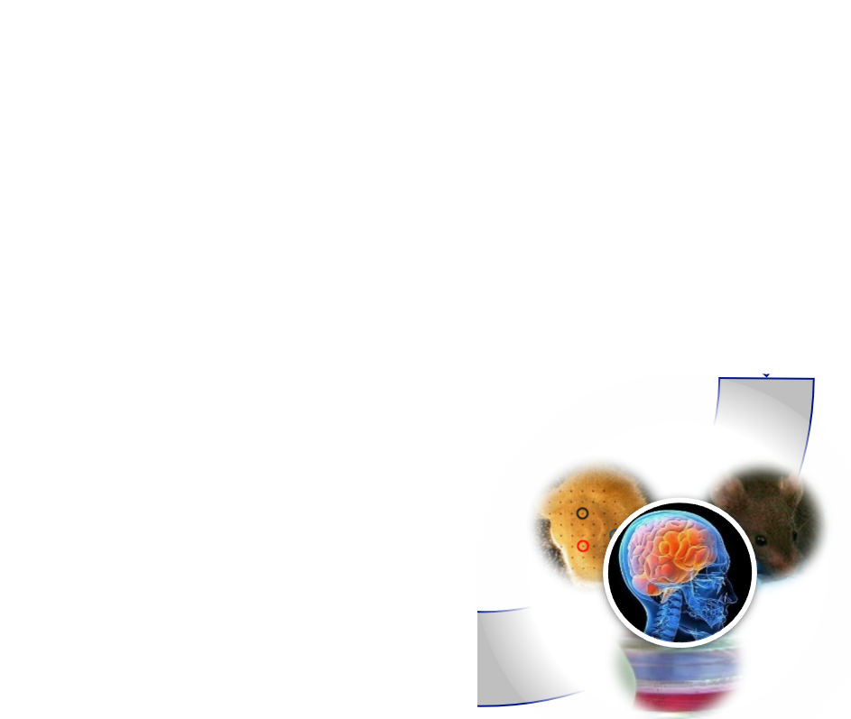

--

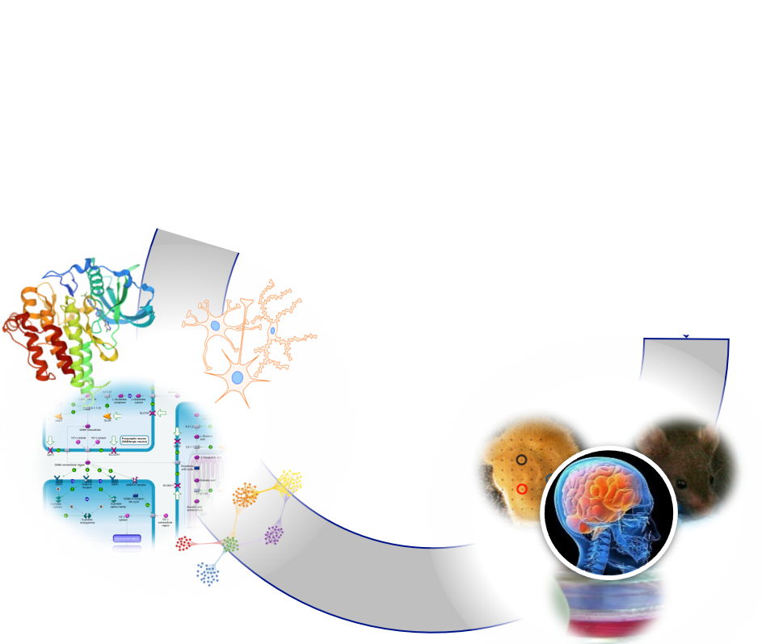

--

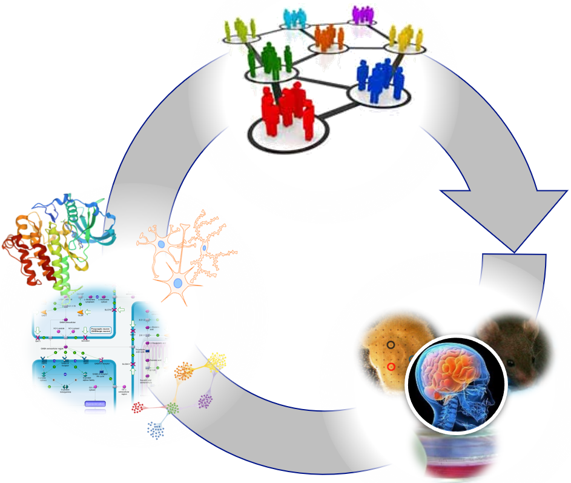

<!----------------------------------------------------------------------------->

---

## From data to wisdom

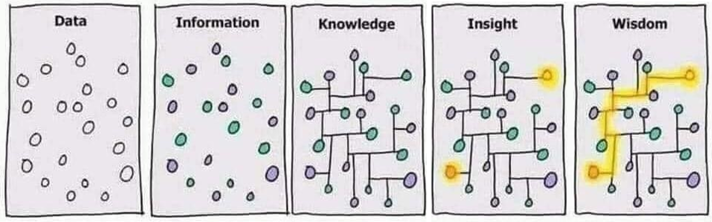

<p style="position: absolute; bottom:3%; right:10%; margin:0; font-size:small; font-style:italic;">
<strong>Credit</strong>: from twitter (unknown author)
</p>

???

```{r, echo=FALSE, results='asis'}
cat(notes$knowledge)
```

--

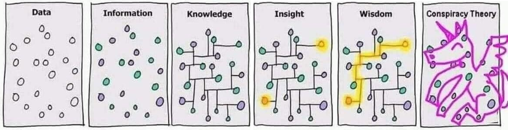

--

<svg style="position: absolute; top:198px; left:410px; width:170px; height:260px">
  <rect width="170px" height="260px" style="fill:transparent;stroke-width:10;stroke:orange;"></rect>
  Rectangle highlighting the knowledge related drawing
</svg>

<!----------------------------------------------------------------------------->

---

## Expected features of the knowledge to manage

???

```{r, echo=FALSE, results='asis'}
cat(notes$knowledge_features)
```

--

- Diverse concepts
- Connected concepts
<li style="visibility:hidden;"></li>

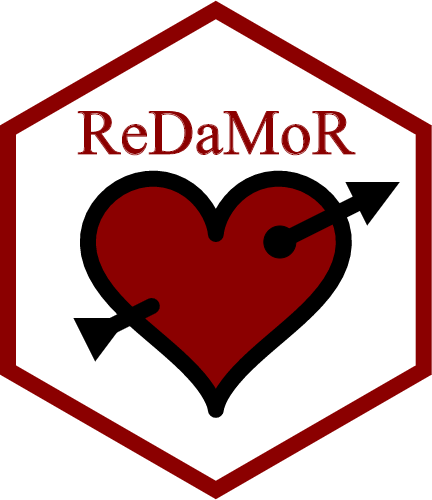

--

- Tabular data
- To use in R and beyond
<li style="visibility:hidden;"></li>


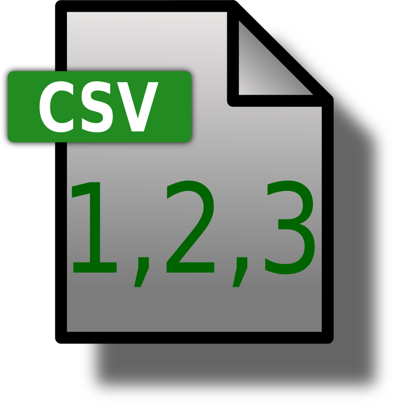


--

- Non monolytic knowledge: management of independent pieces
- Ready for integration on the basis of shared concepts
- Diverse implementation of shared concepts
<li style="visibility:hidden;"></li>


<p style="position: absolute; bottom:3%; right:10%; margin:0; font-size:small; font-style:italic;">
<a href="https://f1000research.com/articles/7-195" target="_blank">
BED: a Biological Entity Dictionary
</a>
 | 
<a href="https://f1000research.com/articles/9-942" target="_blank">
DODO: Dictionary Of Disease Ontologies
</a>
<span style="visibility:hidden;"> | </span>
<a href="https://clickhouse.com/" target="_blank" style="visibility:hidden;">
https://clickhouse.com/
</a>
</p>

--

- Potentially billions of records
- Tables to be used entirely or by subset
- No frequent updates but to be versioned
- Potential restriction of use


<p style="position: absolute; bottom:3%; right:10%; margin:0; font-size:small; font-style:italic;">
<a href="https://f1000research.com/articles/7-195" target="_blank">
BED: a Biological Entity Dictionary
</a>
 | 
<a href="https://f1000research.com/articles/9-942" target="_blank">
DODO: Dictionary Of Disease Ontologies
</a>
<span> | </span>
<a href="https://clickhouse.com/" target="_blank">
https://clickhouse.com/
</a>
</p>

<!----------------------------------------------------------------------------->

---

## MDB: a Modeled Database for each knowledge resource

<p style="position: absolute; bottom:3%; right:10%; margin:0; font-size:small; font-style:italic;">
<a href="https://github.com/patzaw/ReDaMoR">
https://github.com/patzaw/ReDaMoR
</a>
 | 
<a href="https://github.com/patzaw/TKCat">
https://github.com/patzaw/TKCat
</a>
</p>

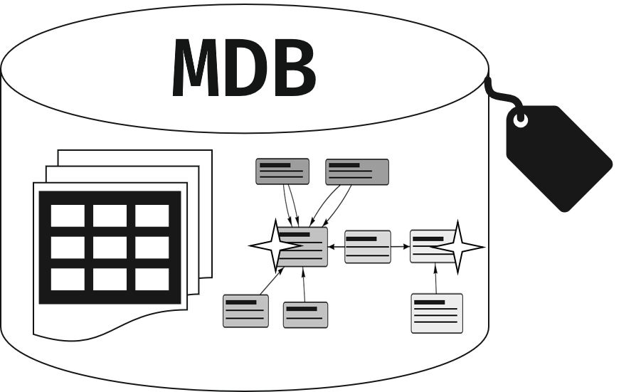

#### Features

???

```{r, echo=FALSE, results='asis'}
cat(notes$mdb_features)
```

--

- **Data**: tables and matrices

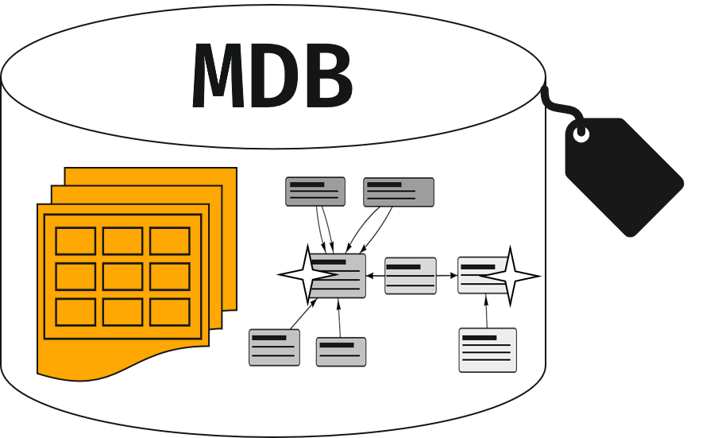

--

- **Data model**: Formal description of the data


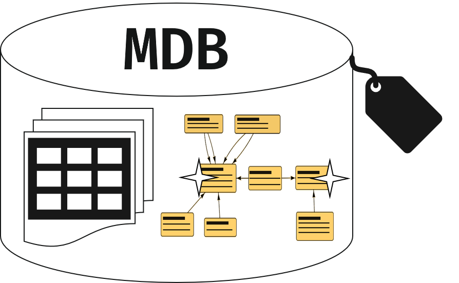

--

- **Description**: general information about the data

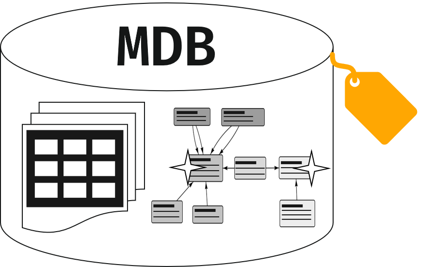

--

- **Collections**: tables referring to key concepts

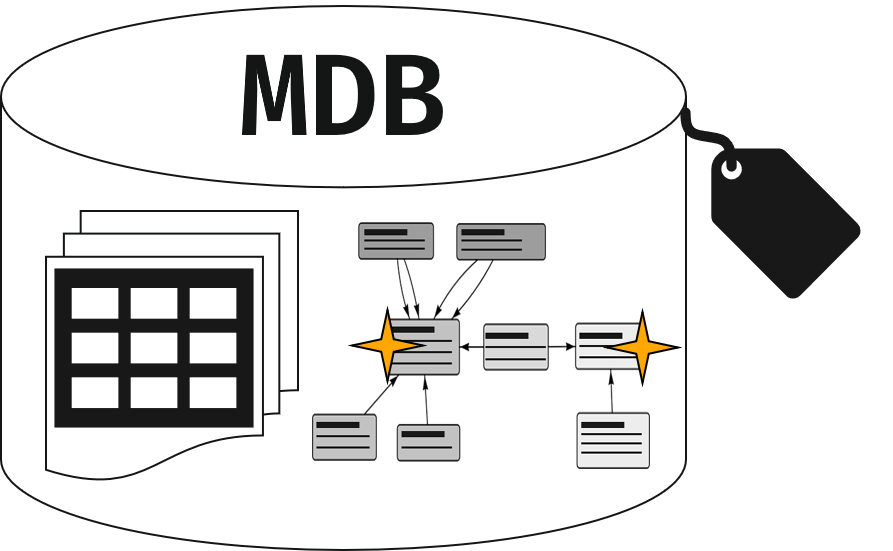

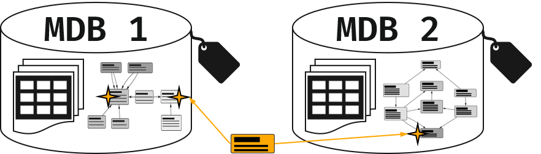

--

- **Implementation**: in memory, in files, in ClickHouse


--

#### TKCat

- **Tailored Knowledge Catalog**: a package for managing and using MDBs

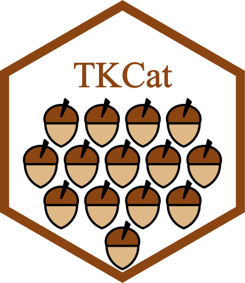

<!----------------------------------------------------------------------------->

---

## Drafting a data model in R with ReDaMoR

<p style="position: absolute; bottom:3%; right:10%; margin:0; font-size:small; font-style:italic;">
<a href="https://doi.org/10.1093/nar/gky1105" target="_blank">
HPO: <strong>Köhler et al. (2019)</strong>
</a>
 |
<a href="https://patzaw.github.io/ReDaMoR/ReDaMoR.html#41_Drafting_a_data_model_from_data_frames" target="_blank">
<strong>ReDaMoR user guide</strong> &gt; Drafting a data model
</a>
</p>

```{r}
library(readr)
hpo_data_dir <- system.file("examples/HPO-subset", package="ReDaMoR")
{{HPO_hp <- read_tsv(file.path(hpo_data_dir, "HPO_hp.txt"))}}
{{HPO_diseases <- read_tsv(file.path(hpo_data_dir, "HPO_diseases.txt"))}}
{{HPO_diseaseHP <- read_tsv(file.path(hpo_data_dir, "HPO_diseaseHP.txt"))}}
```

???

```{r, echo=FALSE, results='asis'}
cat(notes$draft)
```

--

```{r, eval=FALSE}
library(ReDaMoR)
{{hpo_model <- df_to_model(HPO_hp, HPO_diseases, HPO_diseaseHP)}}
plot(hpo_model)
```

```{r, echo=FALSE, results='asis'}
library(ReDaMoR)
hpo_model <- df_to_model(HPO_hp, HPO_diseases, HPO_diseaseHP)
hpo_model <- lapply(hpo_model, function(x){
   x$display$y <- 0
   return(x)
}) %>%
   RelDataModel()
hpo_model$HPO_hp$display$x <- 0
hpo_model$HPO_diseases$display$x <- 200
hpo_model$HPO_diseaseHP$display$x <- 400
pp <- plot(hpo_model) %>%
   visOptions(width="100%", height="150px")
pp$sizingPolicy <- htmlwidgets::sizingPolicy(
   browser.defaultWidth = "1000px",
   browser.defaultHeight = "150px",
   browser.padding=0,
   browser.fill = FALSE
)
cat(hwIframe(
   p=pp,
   style="height:200px; width:100%; border-style:none; background-color:transparent;"
))
```

<!----------------------------------------------------------------------------->

---

## Creating a data model in R with ReDaMoR

<p style="position: absolute; bottom:3%; right:10%; margin:0; font-size:small; font-style:italic;">
<a href=" https://pgodard.shinyapps.io/ReDaMoR/" target="_blank">
Try the GUI in shinyapps.io
</a>
 | 
<a href="https://patzaw.github.io/ReDaMoR/ReDaMoR.html#3_Creating_and_modifying_relational_data_using_the_graphical_user_interface" target="_blank">
<strong>ReDaMoR user guide</strong> &gt; Creating a data model
</a>
</p>

```{r, eval=FALSE}
hpo_model <- model_relational_data(hpo_model)
```

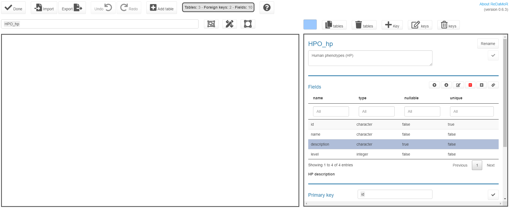

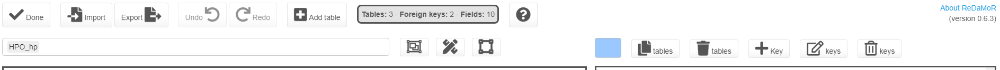

```{r, echo=FALSE, results='asis'}
hpo_model <- read_json_data_model(
   "hpo_model.json"
)[c("HPO_hp", "HPO_diseases", "HPO_diseaseHP")]
pp <- plot(hpo_model) %>%
   visOptions(
      width="100%", height="315px",
      nodesIdSelection=list(
         enabled=TRUE, selected="HPO_hp",
         useLabels=FALSE,
         style="visibility:hidden;"
      )
   )
pp$sizingPolicy <- htmlwidgets::sizingPolicy(
   browser.defaultWidth = "530px",
   browser.defaultHeight = "315px",
   browser.padding=0,
   browser.fill = FALSE
)
cat(hwIframe(
   p=pp,
   style="position:absolute; top:250px; left:80px; height:355px; width:550px; border-style:none; background-color:transparent; z-index:2;"
))
```

???

```{r, echo=FALSE, results='asis'}
cat(notes$model)
```

<!----------------------------------------------------------------------------->

---

## Confronting data to the model

<p style="position: absolute; bottom:3%; right:10%; margin:0; font-size:small; font-style:italic;">
<a href="https://patzaw.github.io/ReDaMoR/ReDaMoR.html#4_Confronting_data" target="_blank">
<strong>ReDaMoR user guide</strong> &gt; Confronting data
</a>
</p>

<div class="l64 code-marg-0">

.pull-left[

```{r, eval=FALSE}
confront_data(hpo_model, data=list(
   "HPO_hp"=HPO_hp,
   "HPO_diseaseHP"=HPO_diseaseHP,
   "HPO_diseases"=HPO_diseases
))
```

<p style="text-align:center;">
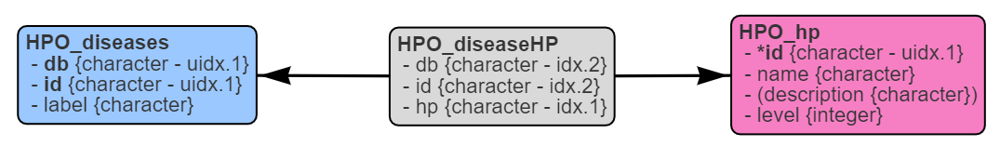
</p>

]

.pull-right[

<div class="confReport" style="height:240px; overflow: auto; background-color:#FFFACD; border-top:5px solid black; border-bottom:5px solid black;">

```{r, echo=FALSE, results='asis'}
confront_data(
   hpo_model,
   data=list(
      "HPO_hp"=HPO_hp,
      "HPO_diseaseHP"=HPO_diseaseHP,
      "HPO_diseases"=HPO_diseases
   ),
   verbose=FALSE
) %>% 
   format_confrontation_report_md(
     title="Confrontation with original data",
     level=0, numbered=FALSE
   ) %>% 
   stringr::str_remove_all("[{].*[}]") %>% 
   markdown::markdownToHTML(
      text=.,
      fragment.only=TRUE
   ) %>% 
   cat()
```

</div>

]

.pull-left[

```{r, eval=FALSE}
HPO_hp <- mutate(HPO_hp, level=`as.integer(level)`)
HPO_diseases <- mutate(HPO_diseases, id=`as.character(id)`)
HPO_diseaseHP <- mutate(HPO_diseaseHP, id=`as.character(id)`)
confront_data(hpo_model, data=list(
   "HPO_hp"=HPO_hp,
   "HPO_diseaseHP"=HPO_diseaseHP,
   "HPO_diseases"=HPO_diseases
))
```

]

.pull-right[

<div class="confReport" style="height:150px; overflow: auto; background-color:#FFFACD; border-top:5px solid black; border-bottom:5px solid black; margin-top:20px;">

```{r, echo=FALSE, results='asis'}
HPO_hp <- mutate(HPO_hp, level=as.integer(level))
HPO_diseases <- mutate(HPO_diseases, id=as.character(id))
HPO_diseaseHP <- mutate(HPO_diseaseHP, id=as.character(id))
confront_data(
   hpo_model,
   data=list(
      "HPO_hp"=HPO_hp,
      "HPO_diseaseHP"=HPO_diseaseHP,
      "HPO_diseases"=HPO_diseases
   ),
   verbose=FALSE
) %>% 
   format_confrontation_report_md(
     title="Confrontation with corrected data",
     level=0, numbered=FALSE
   ) %>% 
   stringr::str_remove_all("[{].*[}]") %>% 
   markdown::markdownToHTML(
      text=.,
      fragment.only=TRUE
   ) %>% 
   cat()
```

</div>

]

</div>

???

```{r, echo=FALSE, results='asis'}
cat(notes$confront)
```

<!----------------------------------------------------------------------------->

---
class: comp-title

## Creating and using an MDB with TKCat

<p style="position: absolute; bottom:3%; right:10%; margin:0; font-size:small; font-style:italic;">
<a href="https://patzaw.github.io/TKCat/TKCat-User-guide.html#2_Create_an_MDB:_a_minimal_example" target="_blank">
<strong>TKCat user guide</strong> &gt; Create an MDB
</a>
 | 
<a href="https://patzaw.github.io/TKCat/TKCat-User-guide.html#3_Leveraging_MDB" target="_blank">
<strong>TKCat user guide</strong> &gt; Leveraging MDB
</a>
</p>

.pull-left[

#### MDB creation

```{r, eval=FALSE}
library(TKCat)
hpo <- `memoMDB`(
   `dataTables`=list(
      "HPO_hp"=HPO_hp,
      "HPO_diseases"=HPO_diseases,
      "HPO_diseaseHP"=HPO_diseaseHP
   ),
   `dataModel`=hpo_model,
   `dbInfo`=list(
      name="miniHPO",
      title="Very small extract of the human phenotype ontology",
      description="For demonstrating ReDaMoR and TKCat capabilities...",
      url="https://hpo.jax.org/app/",
      version="0.1",
      maintainer="Patrice Godard <patrice.godard@gmail.com>"
   )
)
```

```{r, echo=FALSE}
library(TKCat)
hpo <- memoMDB(
   dataTables=list(
      "HPO_hp"=HPO_hp,
      "HPO_diseases"=HPO_diseases,
      "HPO_diseaseHP"=HPO_diseaseHP
   ),
   dataModel=hpo_model,
   dbInfo=list(
      name="miniHPO",
      title="Very small extract of the human phenotype ontology",
      description="For demonstrating ReDaMoR and TKCat capabilities...",
      url="https://hpo.jax.org/app/",
      version="0.1",
      maintainer="Patrice Godard <patrice.godard@gmail.com>"
   )
)
```

]

???

```{r, echo=FALSE, results='asis'}
cat(notes$mdb)
```

--

.pull-right[

#### Explore and retrieve information


```{r, eval=FALSE}
db_info(hpo)
data_model(hpo)
```

```{r, eval=FALSE}
hpo %>% select(HPO_diseases, HPO_diseaseHP)
hpo %>% pull(HPO_diseases) %>% 
   head(3)
```

```{r, echo=FALSE}
hpo %>% pull(HPO_diseases) %>%
   head(3)
```

]

<!----------------------------------------------------------------------------->

---
class: code-marg-5

## Leverage the MDB data model: `filter`

<p style="position: absolute; bottom:3%; right:10%; margin:0; font-size:small; font-style:italic;">
<a href="https://patzaw.github.io/TKCat/TKCat-User-guide.html#35_Filtering_and_joining" target="_blank">
<strong>TKCat user guide</strong> &gt; Filtering and joining
</a>
</p>

.pull-left[

```{r}
dims(hpo) %>% select(name, nrow)
```

]

.pull-right[

```{r, eval=FALSE}
data_model(hpo) %>% plot()
```

```{r, echo=FALSE, results='asis'}
pp <- plot(data_model(hpo)) %>%
   visOptions(width="100%", height="100px")
pp$sizingPolicy <- htmlwidgets::sizingPolicy(
   browser.defaultWidth = "500px",
   browser.defaultHeight = "100px",
   browser.padding=0,
   browser.fill = FALSE
)
cat(hwIframe(
   p=pp,
   style="height:120px; width:100%; border-style:none; background-color:transparent;"
))
```

]

<p style="margin:5px; visibility:hidden;">_</p>

```{r, eval=FALSE}
fhpo <- hpo %>% `filter(HPO_hp=stringr::str_detect(description, "eye"))`
```


```{r, echo=FALSE}
fhpo <- hpo %>% filter(HPO_hp=stringr::str_detect(description, "eye"))
```

???

```{r, echo=FALSE, results='asis'}
cat(notes$filter)
```

--

.pull-left[

```{r}
fhpo %>% dims() %>% select(name, nrow)
```

]

.pull-right[

```{r, eval=FALSE}
data_model(fhpo) %>% plot()
```

```{r, echo=FALSE, results='asis'}
pp <- plot(data_model(fhpo)) %>%
   visOptions(width="100%", height="100px")
pp$sizingPolicy <- htmlwidgets::sizingPolicy(
   browser.defaultWidth = "500px",
   browser.defaultHeight = "100px",
   browser.padding=0,
   browser.fill = FALSE
)
cat(hwIframe(
   p=pp,
   style="height:120px; width:100%; border-style:none; background-color:transparent;"
))
```

]

<!----------------------------------------------------------------------------->

---
class: code-marg-5

## Leverage the MDB data model: `join`

<p style="position: absolute; bottom:3%; right:10%; margin:0; font-size:small; font-style:italic;">
<a href="https://patzaw.github.io/TKCat/TKCat-User-guide.html#35_Filtering_and_joining" target="_blank">
<strong>TKCat user guide</strong> &gt; Filtering and joining
</a>
</p>

.pull-left[

```{r}
dims(fhpo) %>% select(name, nrow)
```

]

.pull-right[

```{r, eval=FALSE}
data_model(fhpo) %>% plot()
```

```{r, echo=FALSE, results='asis'}
pp <- plot(data_model(fhpo)) %>%
   visOptions(width="100%", height="100px")
pp$sizingPolicy <- htmlwidgets::sizingPolicy(
   browser.defaultWidth = "500px",
   browser.defaultHeight = "100px",
   browser.padding=0,
   browser.fill = FALSE
)
cat(hwIframe(
   p=pp,
   style="height:120px; width:100%; border-style:none; background-color:transparent;"
))
```

]

<p style="margin:5px; visibility:hidden;">_</p>

```{r, eval=FALSE}
jhpo <- fhpo %>% `join_mdb_tables(c("HPO_hp", "HPO_diseaseHP", "HPO_diseases"))`
```

```{r, echo=FALSE}
jhpo <- fhpo %>% join_mdb_tables(c("HPO_hp", "HPO_diseaseHP", "HPO_diseases"))
```

???

```{r, echo=FALSE, results='asis'}
cat(notes$join)
```

--


.pull-left[

```{r}
jhpo %>% dims() %>% select(name, nrow)
```

]

.pull-right[

```{r, eval=FALSE}
data_model(jhpo) %>% plot()
```

```{r, echo=FALSE, results='asis'}
pp <- plot(data_model(jhpo)) %>%
   visOptions(width="100%", height="100px")
pp$sizingPolicy <- htmlwidgets::sizingPolicy(
   browser.defaultWidth = "500px",
   browser.defaultHeight = "100px",
   browser.padding=0,
   browser.fill = FALSE
)
cat(hwIframe(
   p=pp,
   style="height:120px; width:100%; border-style:none; background-color:transparent;"
))
```

]

<!----------------------------------------------------------------------------->

---

## MDB implementations

<p style="position: absolute; bottom:3%; right:10%; margin:0; font-size:small; font-style:italic;">
<a href="https://patzaw.github.io/TKCat/TKCat-User-guide.html#26_Writing_an_MDB_in_files" target="_blank">
<strong>TKCat user guide</strong> &gt; MDB in files
</a>
 | 
<a href="https://patzaw.github.io/TKCat/TKCat-User-guide.html#32_MDB_implementations" target="_blank">
<strong>TKCat user guide</strong> &gt; MDB implementations
</a>
</p>

<div style="height:25px; visibility:hidden;">a</div>

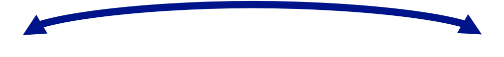


<div class="full-left" style="float:left; width:350px">

.pull-left[

#### In memory (`as_memoMDB()`)

- All the data loaded in R memory <br> &nbsp;

- Fast but greedy <br> &nbsp;

- Convenient for using whole tables

]

</div>

<div class="full-left" style="float:left; width:350px; margin-left:16px;">

.pull-left[

#### In files (`as_fileMDB()`)

- Data in files until requested (`pull()`, `filter()`, ...)

- Not convenient for subsetting (slow)

- Convenient for archiving and sharing

]

</div>

<div class="full-left" style="float:right; width:350px">

.pull-left[

#### In ClickHouse DBMS (`as_chMDB()`)

- Data in DBMS until requested (`pull()`, `filter()`, ...)

- Efficient to get subsets <br> (`get_query()`)

- Convenient for sharing and managing access

- Versioning

]

</div>

???

```{r, echo=FALSE, results='asis'}
cat(notes$implementations)
```

<!----------------------------------------------------------------------------->

---

## TKCat: a data warehouse management system

<p style="position: absolute; bottom:3%; right:10%; margin:0; font-size:small; font-style:italic;">
<a href="https://patzaw.github.io/TKCat/TKCat-User-guide.html#42_chTKCat" target="_blank">
<strong>TKCat user guide</strong> &gt; chTKCat
</a>
 | 
<a href="https://patzaw.github.io/TKCat/TKCat-User-guide.html#51_chTKCat_operations" target="_blank">
<strong>TKCat user guide</strong> &gt; chTKCat operations
</a>
</p>

.left-column[

```{r, eval=FALSE}
k <- chTKCat(
   host="localhost",
   user="default",
   password=""
)
explore_MDBs(k)
```

]

.right-column[

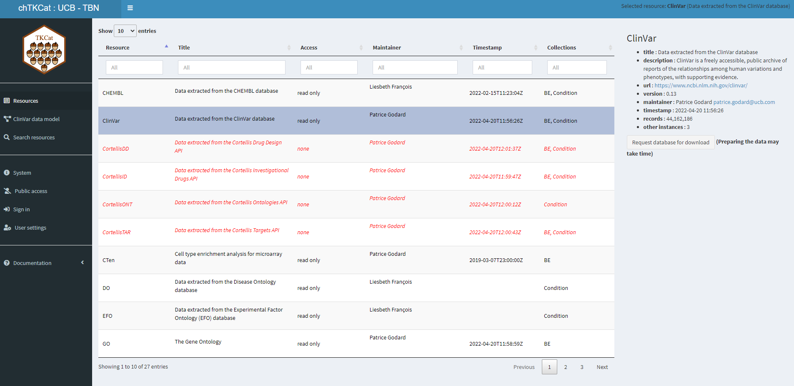

]

???

```{r, echo=FALSE, results='asis'}
cat(notes$tkcat)
```

--

<div style="position: absolute; top:125px; left:200px; width:810px; padding:5px; border:solid black 3px; background:white;">
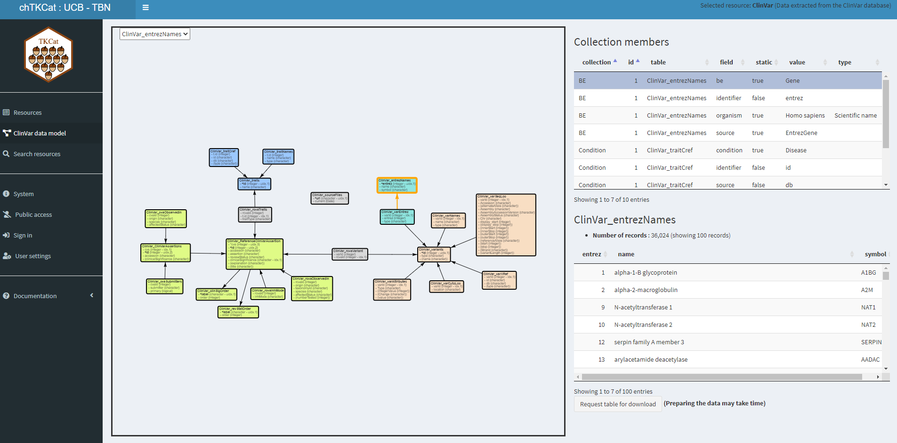
</div>

<!----------------------------------------------------------------------------->

---
class: code-marg-5

## Merging MDBs with collections

<p style="position: absolute; bottom:3%; right:10%; margin:0; font-size:small; font-style:italic;">
<a href="https://doi.org/10.1093/nar/gkx1153" target="_blank">
ClinVar: <strong>Landrum et al. (2018)</strong>
</a>
 | 
<a href="https://patzaw.github.io/TKCat/TKCat-User-guide.html#36_Merging_MDBs_with_collections" target="_blank">
<strong>TKCat user guide</strong> &gt; Merging with collections
</a>
</p>

```{r dodoMerge, echo=FALSE, results='hide', cache=TRUE}
clinvar <- read_fileMDB(system.file("examples/ClinVar", package="TKCat"))
hpo <- hpo %>% add_collection_member(
   collection="Condition",
   table="HPO_diseases",
   condition=list(
      value="Disease", static=TRUE
   ),
   source=list(
      value="db", static=FALSE
   ),
   identifier=list(
      value="id", static=FALSE
   )
)
shared_collections <- get_shared_collections(
   hpo, clinvar
)
hpo_clinvar <- merge(
   hpo, clinvar,
   by=shared_collections[1,],
   dmAutoLayout=FALSE
)
```


```{r, echo=FALSE, results='asis'}
tp <- hpo_clinvar %>% data_model()
tp$Condition_1_HPO_diseases_1_ClinVar_traitCref$display$x <-
   tp$ClinVar_traitCref$display$x
tp <- unclass(tp)
for(
   n in
   c(
      "HPO_diseases", "HPO_diseaseHP", "HPO_hp",
      "Condition_1_HPO_diseases_1_ClinVar_traitCref"
   )
){
   tp[[n]]$display$y <- -250
}
tp <- RelDataModel(tp)
pp <- tp %>% plot() %>%
   visOptions(width="100%", height="460px")
pp$sizingPolicy <- htmlwidgets::sizingPolicy(
   browser.defaultWidth = "1000px",
   browser.defaultHeight = "460px",
   browser.padding=0,
   browser.fill = FALSE
)
cat(hwIframe(
   p=pp,
   style="height:470px; width:95%; border-style:none; background-color:transparent;"
))
```

???

```{r, echo=FALSE, results='asis'}
cat(notes$merging)
```

<!----------------------------------------------------------------------------->

---

## Supported data types

- character, numeric, integer, logic, Date, POSIXct (time)

???

```{r, echo=FALSE, results='asis'}
cat(notes$types)
```

--

<div class="r70">

.pull-left[

- base64 (file)

]

.pull-right[

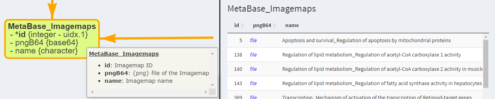

]

--

.pull-left[

- matrix and sparse matrix

]

.pull-right[

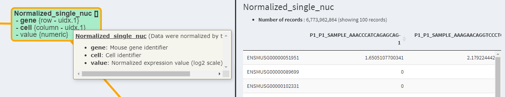

]

</div>

<!----------------------------------------------------------------------------->

---
class: comp-title

## Acknowledgements

<div style="width:85%; margin-left:auto; margin-right:0%;">

.pull-left[

### Supporting tools

- [tidyverse](https://www.tidyverse.org/) and related packages

- [visNetwork](https://datastorm-open.github.io/visNetwork/)

- [shiny](https://shiny.rstudio.com/) and related packages

- [ClickHouse](https://clickhouse.com/)
and [RClickhouse](https://github.com/IMSMWU/RClickhouse)

- [Matrix](https://cran.r-project.org/package=Matrix)

- **Many others**:
   - [ReDaMoR dependencies](https://github.com/patzaw/ReDaMoR#dependencies)
   - [TKCat dependencies](https://github.com/patzaw/TKCat#dependencies)
   
- [CRAN](https://cran.r-project.org/)

]

???

```{r, echo=FALSE, results='asis'}
cat(notes$acknowledgements)
```

--

.pull-right[

### UCB team

#### Managers and Developers

- Jonathan van Eyll
- Liesbeth François
- Yuliya Nigmatullina

#### Users and testers

- Aurélie Bousard
- Olga Giannakopoulou
- Ioana Cutcutache
- Bram Van de Sande
- Waqar Ali
- John Santa Maria

]

</div>

<!----------------------------------------------------------------------------->

---
layout: false
count: false
background-image: url("UCB-theme/UCB-logo-foot.png"), url("media/user2022-logo.png")
background-position: 3% 97%, 98% 3%
background-size: 15%, 6%


<a href="https://patzaw.github.io/TKCat/useR2022/TKCat-useR2022-Patrice-Godard.html" target="_blank">
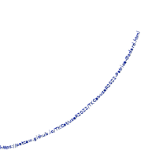
</a>

<div style="position:absolute; width:60%; left:20%; top:120px; text-align:center;">
<a href="https://patzaw.github.io/TKCat/useR2022/TKCat-useR2022-Patrice-Godard.html">

</a>
</div>

<div style="position:absolute; left:2%; top:13%;writing-mode:vertical-rl; transform:rotate(-180deg);">
Slides created with <a href="https://github.com/yihui/xaringan" target="_blank">xaringan</a>
and <a href="https://pkg.garrickadenbuie.com/xaringanthemer/" target="_blank">xaringanthemer</a>
</div>

???

```{r, echo=FALSE, results='asis'}
cat(notes$closing)
```


<!----------------------------------------------------------------------------->

