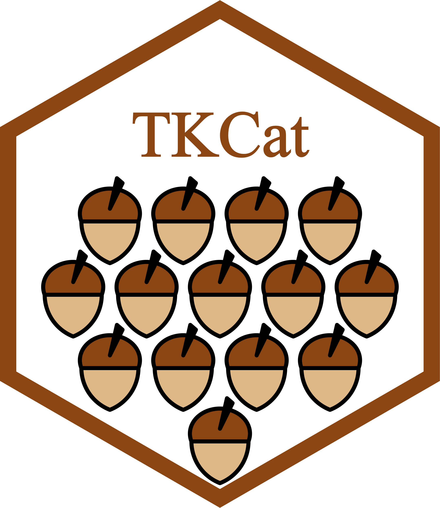

```{r setup, message=FALSE, echo=FALSE, include=FALSE, cache=FALSE}
library(knitr)
opts_chunk$set(
   include=TRUE,
   echo=TRUE,
   message=FALSE,
   warning=FALSE,
   cache=FALSE,
   cache.lazy=FALSE
)
library(TKCat)
```

```{r child = 'supp/urls.Rmd'}
```

::: {style="width:200px;"}
{width="100%"}
:::

# Introduction

```{r child = 'supp/genIntro.Rmd'}
```

Some MDBs refer to the same concepts and could be merged accordingly. However
they often use different vocabularies or scopes. Collections are a used to
identify such concepts and to define a way to document formally the scope used
by the different members of these collections. Thanks to this formal
description, tools can be used to automatically combine MDBs refering to the
same collection but using different scopes.

This vignette describes how to create TKCat Collections, document collection
members and create functions to support the merging of MDBs. The advantages and
uses of Collections are presented in the [general user
guide](TKCat-User-guide.html#merging-with-collections).

# Creating a collection

A collection is defined by a JSON document. This document should fulfill the
requirements defined by the
[Collection-Schema.json](https://github.com/patzaw/TKCat/blob/master/inst/Collections/Collection-Schema.json).
Two collection are available by default in the TKCat package.

```{r}
list_local_collections()
```

Here is how the *BE* collection is defined.

```{r, eval=FALSE}
get_local_collection("BE") %>%
   paste('```json', ., '```', sep="\n") %>% cat()
```

```{r, echo=FALSE, results='asis'}
get_local_collection("BE") %>%
   paste('```json', ., '```', sep="\n") %>% cat()
```

A collection should refer to the `"TKCat_collections_1.0"` **\$schema**. It
should then have the following properties:

-   **\$id**: the identifier of the collection

-   **title**: the title of the collection

-   **type**: always `object`

-   **description**: a short description of the collection

-   **properties**: the properties that should be provided by collection
    members. In this case:

    -   **\$schema**: should be the *\$id* of the collection

    -   **\$id**: the identifier of the collection member: a string

    -   **collection**: should be "BE"

    -   **resource**: the name of the resource having collection members: a
        string

    -   **tables**: an array of tables corresponding to collection members. Each
        item being a table with the following features:

        -   **name**: the name of the table

        -   **fields**: the required fields

            -   **be**: if **static** is true then **value** correspond to the
                be value valid for all the records. If not **value** correspond
                to the table column with the be value for each record.
            -   **source**: if **static** is true then **value** correspond to
                the source value valid for all the records. If not **value**
                correspond to the table column with the source value for each
                record.
            -   **organism**: if **static** is true then **value** correspond to
                the organism value valid for all the records. If not **value**
                correspond to the table column with the organism value for each
                record. **type** indicate how organisms are identified:
                `"Scientific name"` or `"NCBI taxon identifier"`.

# Identifying collection members

Identifying collection members of an *MDB* can be done by providing a table as
shown in the [general user guide](TKCat-User-guide.html#hpo) or by writing a
JSON file like the following one which correspond to BE members of the CHEMBL
MDB.

```{r, eval=FALSE}
system.file(
   "examples/CHEMBL/model/Collections/BE-CHEMBL_BE_1.0.json",
   package="TKCat"
) %>% 
   readLines() %>% paste(collapse="\n")
```

```{r, echo=FALSE, results='asis'}
system.file(
   "examples/CHEMBL/model/Collections/BE-CHEMBL_BE_1.0.json",
   package="TKCat"
) %>% 
   readLines() %>% paste(collapse="\n") %>%
   paste('```json', ., '```', sep="\n") %>% cat()
```

The identification of collection members should fulfill the requirements defined
by the collection JSON document, and therefore pass the following validation.

```{r}
jsonvalidate::json_validate(
   json=system.file(
      "examples/CHEMBL/model/Collections/BE-CHEMBL_BE_1.0.json",
      package="TKCat"
   ),
   schema=get_local_collection("BE")
)
```

This validation is done automatically when reading a *fileMDB* object or when
setting collection members with the `collection_members()` function.

# Collection mapper functions

The `merge.MDB()` and the `map_collection_members()` functions rely on functions
to map members of the same collection. When recorded (using the
`import_collection_mapper()` function), these function can be automatically
identified by TKCat, otherwise or according to user needs, these functions could
be provided using the `funs` (for `merge.MDB()`) or the `fun` (for
`map_collection_members()`) parameters. Two mappers are pre-recorded in TKCat,
one for the *BE* collection and one for the *Condition* collection. They can be
retrieved with the `get_collection_mapper()` function.

```{r, eval=FALSE}
get_collection_mapper("BE")
```

```{r, echo=FALSE, results='asis'}
get_collection_mapper("BE") %>% 
   format() %>% paste(collapse="\n") %>% 
   paste('```r', ., '```', sep="\n") %>% cat()
```

A mapper function must have at least an x and a y parameters. Each of them
should be a data.frame with all the field values corresponding to the fields
defined in the collection. Additional parameters can be defined and will be
forwarded using `...`. This function should return a data frame with all the
fields values followed by "\_x" and "\_y" suffix accordingly.

# Acknowledgments

This work was entirely supported by [UCB Pharma](https://www.ucb.com/) (Early
Solutions department).
