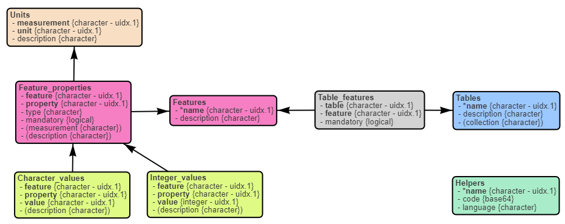

```{r setup, message=FALSE, echo=FALSE, include=FALSE, cache=FALSE}
library(knitr)
opts_chunk$set(
   include=TRUE,
   echo=TRUE,
   message=TRUE,
   warning=TRUE,
   cache=FALSE,
   cache.lazy=FALSE
)
library(TKCat)
```

In TKCat, knowledge resources are manipulated as modeled
database (MDB) objects. These objects provide access to the data tables along
with a general description of the resource and a detail data model documenting
the tables, their fields and their relationships.
These MDB are then gathered in TKCat catalogs that can be explored an shared.

Beside the relational model, no additional constraints are applied to
an MDB. This allows for high flexibility in the data that can be managed.
However, in some cases, it could be useful to add further constraints to ensure
that the data is compatible with specific analysis or integration workflows.
In TKCat, this feature is supported by KMR (Knowledge Management Requirements).
A KMR object is meant to be shared and centrally managed.
MDBs intended to meet these requirements must contain technical tables
referring to the corresponding KMR. When grouped in the same TKCat catalog,
KMRs and MDBs form a coherent corpus of knowledge that can be leveraged
consistently by KMR-tailored functions.

The first part of this document describes how to create a KMR object.
The second part shows how to refer to these requirements in an MDB object.
Finally, the third part describes how to use KMR and MDB together to leverage
pieces of knowledge (POK).


# Defining KMR

## KMR organization

A KMR object is an MDB object with a predefined data model. It is simply
created by calling the `create_KMR()` function which takes some metadata as
arguments.

```{r}
ebkm <- create_KMR(
   name="EBKM",
   title="Experimental and Biological Knowledge Management",
   description="Requirements for integrating knowledge from biological research activities",
   version="0.1",
   maintainer="[Patrice Godard](mailto:patrice.godard@gmail.com)"
)
```

The figure below shows the data model of such an object. A KMR object describes
requirements regarding:
   
   - Tables: the features that can be found in the table and which of them
   are mandatory.
   
   - Features: the properties composing the feature and which of them are
   mandatory. In tables providing the feature, there should be one column
   per feature property.
   
   - Feature properties: the type and the kind of measurement (if relevant)
   
   - Units: possible units for measurements
   
   - Possible character or integer values for measurement properties
   
It's also possible to store helpers in a KMR object. These helpers are typically
functions used to query MDBs fitting KMR requirements.

```{r, eval=FALSE}
data_model(ebkm) %>% 
   plot()
```



## Define requirements

### Table and mandatory features

In the example below, we define requirements for tables providing information
about biological samples. Such table must provide at least a sample name and
a sample description.

It is specified by first defining the features,

```{r}
ebkm <- add_feature_def(
   kmr = ebkm,
   name = "name",
   description = "name/identifier of a record",
   properties = list(
      "value" = list(
         type = "character",
         mandatory = TRUE
      )
   )
)
ebkm <- add_feature_def(
   kmr = ebkm,
   name = "description",
   description = "description of a record",
   properties = list(
      "value" = list(
         type = "character",
         mandatory = TRUE
      )
   )
)
```

and then by defining the table.

```{r}
ebkm <- add_table_def(
   kmr = ebkm,
   name = "samples",
   description = "A table listing samples and associated features",
   mandatory_features=c("name", "description")
)
```

### Optional features

Non mandatory features can then added to the table definition.
For samples, we can define the sex and tissue features and add them
to the table definition:

```{r}
ebkm <- add_feature_def(
   kmr = ebkm,
   name = "sex",
   description = "Subject sex",
   properties = list(
      "value" = list(
         type = "character",
         mandatory = TRUE
      )
   )
)
ebkm <- add_feature_def(
   kmr = ebkm,
   name = "tissue",
   description = "Name of a biological tissue",
   properties = list(
      "value" = list(
         type = "character",
         mandatory = TRUE
      ),
      "identifier" = list(
         type = "character",
         description = "Identifier in reference database",
         mandatory = TRUE
      ),
      "reference" = list(
         type="character",
         description = "Reference database",
         mandatory=TRUE
      ),
      "side" = list(
         type = "character",
         description = "Sampling side",
         mandatory = FALSE
      ),
      "relative side" = list(
         type="character",
         description = "Sampling relative side",
         mandatory = FALSE
      ),
      "side reference" = list(
         type="character",
         description =
            "Reference for relative side (e.g., Handedness, treatment...)",
         mandatory = FALSE
      )
   )
)
ebkm <- add_table_features(
   kmr = ebkm,
   table = "samples",
   features = c("sex", "tissue")
)
```

### Possible values for feature properties

We can also define a list of possible values for some feature property that
we want to standardize as shown below.

-  Possible values for sex

   ```{r}
   ebkm <- add_property_values(
      kmr = ebkm, feature = "sex", property = "value",
      values = c("female", "male")
   )
   ```

-  Tissues must be defined using
the [Uberon](http://obofoundry.org/ontology/uberon.html) ontology.
The way to define sampling side, absolutely or relatively to a reference,
is also controlled.

   ```{r}
   ebkm <- add_property_values(
      kmr = ebkm, feature = "tissue", property = "reference",
      values=c(
         "Uberon" = "https://obophenotype.github.io/uberon/"
      )
   )
   ebkm <- add_property_values(
      kmr = ebkm, feature = "tissue", property = "side",
      values = c("left", "right")
   )
   ebkm <- add_property_values(
      kmr = ebkm, feature = "tissue", property = "relative side",
      values = c("ipsilateral", "contralateral")
   )
   ```

### Measurements

Some feature properties could correspond to measurements with units.
To be able to create such property, we first need to define the possible units.
For example, "age" "value" is a "duration" that can be expressed using
different units, such as "m" (months) or "y" (years).

```{r}
ebkm <- add_unit_def(
   kmr = ebkm,
   measurement = "duration", unit = "s", description = "seconds"
)
ebkm <- add_unit_def(
   kmr = ebkm,
   measurement = "duration", unit = "min", description = "minutes"
)
ebkm <- add_unit_def(
   kmr = ebkm,
   measurement = "duration", unit = "h", description = "hours"
)
ebkm <- add_unit_def(
   kmr = ebkm,
   measurement = "duration", unit = "d", description = "days"
)
ebkm <- add_unit_def(
   kmr = ebkm,
   measurement = "duration", unit = "m", description = "months"
)
ebkm <- add_unit_def(
   kmr = ebkm,
   measurement = "duration", unit = "y", description = "years"
)
ebkm <- add_unit_def(
   kmr = ebkm,
   measurement = "duration", unit = "w", description = "weeks"
)

##

ebkm <- add_feature_def(
   kmr = ebkm,
   name = "age",
   description = "Elapsed time since birth",
   properties = list(
      "value" = list(
         type = "numeric",
         mandatory = TRUE,
         measurement = "duration"
      )
   )
)
ebkm <- add_table_features(
   kmr = ebkm,
   table = "samples",
   features = c("age")
)
```

# KM specifications

## Exploring requirements

Before documenting the specifications of an MDB fitting KMR requirements,
those requirements can be explored using different functions.

-  Get supported table types:

   ```{r}
   list_table_types(ebkm)
   ```

-  Get supported features:

   ```{r}
   list_table_features(ebkm, "samples")
   ```

-  Details about feature properties:

   ```{r}
   list_feature_properties(ebkm, "tissue")
   ```

-  Get property supported values:

   ```{r}
   list_property_values(ebkm, "sex", "value")
   ```

-  Get measurements and units:

   ```{r}
   list_measurements(ebkm)
   list_measurement_units(ebkm, "duration")
   ```

## Documenting MDB specifications

### Simple example

Let's create a simple MDB with only one table with biological samples
information.

```{r}
samples <- tibble(
   name = c("S1", "S2", "S3", "S4"),
   description = c(
      "Sample from left hippocampus from patient 1",
      "Sample from left hippocampus from patient 2",
      "Sample from left hippocampus from patient 3",
      "Sample from left hippocampus from patient 4"
   ),
   sex = c("male", "female", "female", "male"),
   age = c(25, 36, 28, 42),
   tissue_name = rep("hippocampus", 4),
   tissue_id = rep("UBERON_0002421", 4),
   tissue_ref = rep("Uberon", 4),
   tissue_side = rep("left", 4),
   seizures = c(31, 64, 12, 29)
)
model <- ReDaMoR::df_to_model(samples)
mdb <- memoMDB(
   list(samples=samples),
   model,
   dbInfo=list(
      name="Test"
   )
)
```

The specifications of the sample table fitting the EBKM requirement defined
above can be document as following. Additional columns not part of the KMR
requirements (e.g.  "seizures") can still be used in the MDB but are not part
of specifications.

```{r}
mdb <- add_km_spec(mdb, ebkm)
mdb <- add_km_table(
   mdb, ebkm,
   name="samples", type="samples",
   features=list(
      
      ### TBKM mandatory features ###
      list(feature="name", fields="name"),
      list(feature="description", fields="description"),
      
      ### TBKM optional features  ###
      list(feature="age", fields="age", unit="y"),
      list(feature="sex", fields="sex"),
      list(
         feature="tissue",
         fields=list(
            "value"=list(field="tissue_name"),
            "identifier"=list(field="tissue_id"),
            "reference"=list(field="tissue_ref"),
            "side"=list(field="tissue_side")
         )
      )
   )
)
```


# Piece Of Knowledge (POK)

## Helpers

Helpers are R functions that are attached to a KMR or an MDB object to
leverage the provided information.

### KMR helpers

Helpers are written in .R script that are then attach to the object of interest.
For example the following function has been saved the "EBKM-helpers.R" file.

```{r, results='asis', echo=FALSE}
ec <- readLines("EBKM-helpers.R")
cat('```r', sep="\n")
cat(ec, sep="\n")
cat('```', sep="\n")
```

It can be attached to the KMR object as follows:

```{r}
ebkm <- add_helpers(
   ebkm,
   code="EBKM-helpers.R",
   name="R-Helpers",
   language = "R"
)
```

Then the helpers can be retrieved and used as follows:

```{r}
ebkm_helpers <- get_R_helpers(ebkm)
ebkm_helpers$help()
ebkm_helpers$help("get_tissue_ref_url")
ebkm_helpers$get_tissue_ref_url(c("UBERON_0002421", "UBERON_0001876"))
```

### MDB helpers

Helpers can also be added to MDB with KM specifications. For example the
following function summarizes the number of seizures associated to biological
samples:

```{r, results='asis', echo=FALSE}
ec <- readLines("MDB-helpers.R")
cat('```r', sep="\n")
cat(ec, sep="\n")
cat('```', sep="\n")
```

When associating and retrieving MDB helpers, KMR object need to be provided:

```{r}
mdb <- add_helpers(
   mdb,
   kmr = ebkm,
   code="MDB-helpers.R",
   name="R-Helpers",
   language = "R"
)
```

MDB helpers can be retrieved and used similarly as KMR helpers:

```{r}
mdb_helpers <- get_R_helpers(mdb, kmr = ebkm)
mdb_helpers$help("summarize_seizures")
mdb_helpers$summarize_seizures()
```

## POK objects

MDB can be combined with relevant KMR to create POK (Piece Of Knowledge)
objects:

```{r}
pok <- create_POK(mdb, ebkm)
pok
```

A POK object is a list with the following slots:

- mdb: the provided MDB object
- kmr: the provided KMR object
- helpers (optional): functions found in mdb and kmr helpers
- tkcat (optional): a TKCat or chTKCat object from mdb or kmr or directly
provided to the constructor.

POK can be retrieved directly from a TKCat or chTKCat object as examplified
below:

```{r}
tkcat <- TKCat(Test=mdb, EBKM=ebkm)
get_POK(tkcat, "Test", "EBKM")
```


