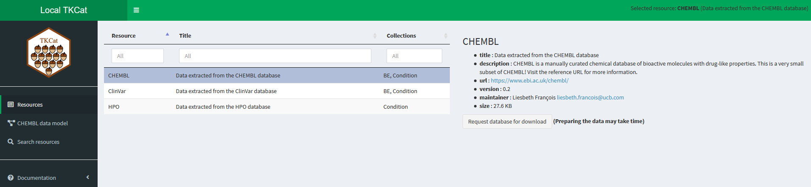

```{r setup, message=FALSE, echo=FALSE, include=FALSE, cache=FALSE}
library(knitr)
opts_chunk$set(
   include=TRUE,
   echo=TRUE,
   message=TRUE,
   warning=TRUE,
   cache=FALSE,
   cache.lazy=FALSE
)
library(TKCat)
igraph_available <- "igraph" %in% installed.packages()[,"Package"]
```

[redamor]: https://patzaw.github.io/ReDaMoR/
[tkcat]: https://patzaw.github.io/TKCat/
[clickhouse]: https://clickhouse.com/
[rclickhouse]: https://github.com/IMSMWU/RClickhouse
[chhttp]: https://github.com/patzaw/ClickHouseHTTP

[hpo]: https://hpo.jax.org/app/
[clinvar]: https://www.ncbi.nlm.nih.gov/clinvar/
[chembl]: https://www.ebi.ac.uk/chembl/

[bed]: https://github.com/patzaw/BED
[dodo]: https://github.com/Elysheba/DODO
[mygene]: https://bioconductor.org/packages/release/bioc/html/mygene.html
[biomart]: https://bioconductor.org/packages/release/bioc/html/biomaRt.html

::: {style="width:200px;"}
{width="100%"}
:::


# Introduction

Research organizations generate, manage, and use more and more knowledge
resources which can be highly heterogenous in their origin, their scope,
and their structure. Making this knowledge compliant
to F.A.I.R. (Findable, Accessible, Interoperable, Reusable) principles is
critical for facilitating the generation of new insights leveraging it.
The aim of the TKCat (Tailored Knowledge Catalog) R package is to facilitate
the management of such resources that are frequently used alone or in
combination in research environments.

In TKCat, knowledge resources are manipulated as modeled
database (MDB) objects. These objects provide access to the data tables along
with a general description of the resource and a detail data model generated
with [ReDaMoR][redamor] documenting the tables, their
fields and their relationships. These MDB are then gathered in catalogs that can
be easily explored an shared. TKCat provides tools to easily subset, filter and
combine MDBs and create new catalogs suited for specific needs.

Currently, there are 3 different implementations of MDBs which are supported
by TKCat: in R memory (memoMDB), in files (fileMDB) and
in [ClickHouse][clickhouse] (chMDB).

This is document is divided in four main sections:

- The first one describes how to build an MDB object,
starting with a minimal example

- The second section shows how to interact with MDB objects to extract and
combine information of interest

- The third section focuses on the use of the
[ClickHouse][clickhouse] implementation of MDB (chMDB)

- The fourth section corresponds to appendices providing technical
information regarding [ClickHouse][clickhouse] related admin tasks
and the implementation of *collections* which are used to identify and leverage
potential relationships between different MDBs.


# Create an MDB: a minimal example

This section shows how to create an MDB object starting from a set of tables in
three steps:

- Create a data model
- Create and validate a modeled database (MDB) by binding the data model
to the dataset
- Document concept collections that can be used to make bridges
across different MDBs

This example focuses on the [Human Phenotype Ontology (HPO)](#hpo).
The HPO aims to provide a standardized vocabulary of
phenotypic abnormalities encountered in human diseases [@kohler_expansion_2019].

## Loading example data

A subset of the HPO is provided within the [ReDaMoR][redamor] package.
We can read some of the tables as follow:

```{r, message=FALSE}
library(readr)
hpo_data_dir <- system.file("examples/HPO-subset", package="ReDaMoR")
```

The `HPO_hp` table gathers human phenotype identifiers, names and descriptions:

```{r, message=FALSE}
HPO_hp <- readr::read_tsv(
   file.path(hpo_data_dir, "HPO_hp.txt")
)
HPO_hp
```

The `HPO_diseases` table gathers disease identifiers and labels from different
disease database.

```{r, message=FALSE}
HPO_diseases <- readr::read_tsv(
   file.path(hpo_data_dir, "HPO_diseases.txt")
)
HPO_diseases
```

The `HPO_diseaseHP` table indicates which phenotype is triggered by
each disease.

```{r, message=FALSE}
HPO_diseaseHP <- readr::read_tsv(
   file.path(hpo_data_dir, "HPO_diseaseHP.txt")
)
HPO_diseaseHP
```

## Creating a data model with ReDaMoR

The [ReDaMoR][redamor] package can be used for drafting a data model from a
set of table: 

```{r, out.height="200px"}
mhpo_dm <- ReDaMoR::df_to_model(HPO_hp, HPO_diseases, HPO_diseaseHP)
if(igraph_available){
   mhpo_dm %>%
      ReDaMoR::auto_layout(lengthMultiplier=80) %>% 
      plot()
}else{
   mhpo_dm %>%
      plot()
}
```

This data model is minimal: only the name of the tables, their fields and their
types are documented. There is no additional constrain regarding the uniqueness
or the completeness of the fields. Also there is no information regarding the
relationships between the different tables.
The `model_relational_data()` can be used to improve the documentation of the
dataset according to what we know about it. This function raises a graphical
interface for manipulating and modifying the data model
(see [ReDaMoR documentation](https://patzaw.github.io/ReDaMoR/articles/ReDaMoR.html)).

```{r, eval=FALSE}
mhpo_dm <- ReDaMoR::model_relational_data(mhpo_dm)
```

```{r, echo=FALSE}
mhpo_dm <- ReDaMoR::read_json_data_model(
   system.file("examples/HPO-model.json", package="ReDaMoR")
)[c("HPO_hp", "HPO_diseases", "HPO_diseaseHP")]
```

Below is the model we get after completing it using the function above.

```{r, out.height="200px"}
plot(mhpo_dm)
```

In this model, we can see that:

- *id* is the **primary key** of the *HPO_hp* table, and therefore
this field must be **unique**;
- *db*/*id* form the  **primary key** of the *HPO_diseases* table and must
also be **unique** when taken together;
- all the fields excepted *description* (in the *HPO_hp* table) are complete
(they cannot be NA);
- the *HPO_diseaseHP* table refers to the *HPO_hp* table using its *HPO_hp*
fields and to the *HPO_diseases* table using its *db* and *id* fields
(such details are shown when putting cursor over the edges).

Moreover, some comments are added at the table and at the field level to give
a better understanding of the data
(shown when putting the cursor over the tables).

## Binding the model to the data in an MDB object

The data model can be explicitly bound to the data in
an MDB (Modeled DataBase) object as shown below.
However, when trying to build the object with the tables we've read and the
data model we have edited, we get the following error message.

```{r, echo=FALSE, results='hide'}
try(
   mhpo_db <- memoMDB(
      dataTables=list(
         HPO_hp=HPO_hp, HPO_diseases=HPO_diseases, HPO_diseaseHP=HPO_diseaseHP
      ),
      dataModel=mhpo_dm,
      dbInfo=list(name="miniHPO")
   ),
   silent=TRUE
)
```

```{r, eval=FALSE}
mhpo_db <- memoMDB(
   dataTables=list(
      HPO_hp=HPO_hp, HPO_diseases=HPO_diseases, HPO_diseaseHP=HPO_diseaseHP
   ),
   dataModel=mhpo_dm,
   dbInfo=list(name="miniHPO")
)
```

<div style="background-color:#FFFACD; border-top:5px solid black; border-bottom:5px solid black; margin-top:50px; margin-bottom:50px">

```{r, echo=FALSE, results='asis'}
get_confrontation_report() %>% 
   format_confrontation_report_md(
      title="miniHPO",
      level=2, numbered=FALSE
   ) %>% 
   cat()
```

</div>

Indeed, according to the edited model (not the very first one automatically
created by ReDaMoR), the `HPO_hp$level` field should contain *integer* values
and the `HPO_diseases$id` and `HPO_diseaseHP$id` fields should
contain *character* values.
The type of the data is among the data model features that are automatically
checked when building an MDB object (along with uniqueness or NA values
for example).

To avoid this error, we can either change the type of the columns of the
data tables:

```{r}
HPO_hp <- mutate(HPO_hp, level=as.integer(level))
HPO_diseases <- mutate(HPO_diseases, id=as.character(id))
HPO_diseaseHP <- mutate(HPO_diseaseHP, id=as.character(id))
mhpo_db <- memoMDB(
   dataTables=list(
      HPO_hp=HPO_hp, HPO_diseases=HPO_diseases, HPO_diseaseHP=HPO_diseaseHP
   ),
   dataModel=mhpo_dm,
   dbInfo=list(name="miniHPO")
)
```

Or we can use the data model to read the data in a fileMDB object:

```{r}
f_mhpo_db <- read_fileMDB(
   path=hpo_data_dir,
   dbInfo=list(name="miniHPO"),
   dataModel=mhpo_dm
)
```

The `read_fileMDB()` function identifies the text files to read in `path` 
according to the `dataModel`. It uses the types documented in the data model
to read the files. By default, the field delimiter is `\t`, but another can
be defined by writing a `delim` slot in the `dbInfo` parameter
(e.g. `dbInfo=list(name="miniHPO", delim="\t")`).

As shown in the message above, by default, `read_fileMDB()` does not perform
optional checks (*unique* fields, *not nullable* fields, *foreign keys*) and
it only checks data on the 10 first records.
Also, the fileMDB data are not loaded in memory until requested by the user.
The object is then smaller than the memoMDB object even if they gather the same
information.

```{r}
print(object.size(mhpo_db), units="Kb")
print(object.size(f_mhpo_db), units="Kb")
compare_MDB(former=mhpo_db, new=f_mhpo_db) %>% 
   DT::datatable(
      rownames=FALSE,
      width="75%",
      options=list(dom="t", pageLength=nrow(.))
   )
```

## Adding information about an MDB

In the table above we can see that several pieces of information are expected
in an MDB object even if not
mandatory (*title*, *description*, *url*, *version*, *maintainer*, *timestamp*).
They can be provided in the `dbInfo` parameter of
the MDB creator function (e.g. `memoMDB()`) or added afterward:

- *title*, *description* and *url* are used to give more details about the scope
of the data and their origin.

```{r}
db_info(mhpo_db)$title <- "Very small extract of the human phenotype ontology"
db_info(mhpo_db)$description <- "For demonstrating ReDaMoR and TKCat capabilities, a very few information from the HPO (human phenotype ontology) has been extracted"
db_info(mhpo_db)$url <- "https://hpo.jax.org/app/"
```

- *version* and *maintainer* are related to db information and the data model
whereas *timestamp* should be used to document the data themselves. 

```{r}
db_info(mhpo_db)$version <- "0.1"
db_info(mhpo_db)$maintainer <- "Patrice Godard"
db_info(mhpo_db)$timestamp <- Sys.time()
```

All this information is displayed when printing the object:

```{r}
mhpo_db
```


## Documenting collection members {#min-coll-memb}

In the HPO example, one table regards human phenotypes (*HPO_hp*) and another
human diseases (*HPO_diseases*). These concepts are general and referenced in
many other knowledge or data resources (e.g. database providing information
about disease genetics).
Therefore, documenting formally such concepts will help to identify how to
connect the HPO example to other resources referencing the same or related
concepts.

In TKCat, these central concepts are referred as members of *collections*.
*Collections* are pre-defined and members must be documented according to
this definition. There are currently two collections provided within the
TKCat package:

```{r}
list_local_collections()
```

Additional collections can be defined by users according to their needs.
Further information about collections implementation is provided in
the [appendix](#collections).

So far, there is no collection member documented in the HPO example described
above, as indicated by the *"No collection member"* statement displayed when
printing the object:

```{r}
mhpo_db
```

However, as just discussed, the *HPO_hp* table refers to human phenotypes and
the *HPO_diseases* table to human diseases. These concept corresponds
to conditions and those tables can be documented as member of
the *Condition* collection.

*Condition* members are documented calling the `add_collection_member()`
function on the MDB object. The two other main arguments are the name of
the `collection` and the name of the `table` in the MDB object.
The other arguments to be provided depend on the collection.
For *Condition* members, three additional arguments must be provided: 

- `condition` indicate the type of the condition ("Phenotype" or "Disease")
- `source` a reference source of the condition identifier
- `identifier` a condition identifier

The functions `get_local_collection()` and `show_collection_def()` can be
used together to identify valid arguments:

```{r}
get_local_collection("Condition") %>%
   show_collection_def()
```

When calling `add_collection_member()`, these arguments must be provided as a
list with 2 elements
named "value" (a character) and "static" (a logical). If "static" is TRUE,
"value" corresponds to the information shared by all the rows of the table.
If "static" is FALSE, "value" indicates the name of the column which provides
this information for each row.

The example below shows how the *HPO_hp* table is documented as a member
of the *Condition* collection.

```{r}
mhpo_db$HPO_hp
mhpo_db <- add_collection_member(
   mhpo_db, collection="Condition", table="HPO_hp",
   condition=list(value="Phenotype", static=TRUE),
   source=list(value="HP", static=TRUE),
   identifier=list(value="id", static=FALSE)
)
```

All rows in this table correspond to a condition
of type "Phenotype" (`condition=list(value="Phenotype", static=TRUE)`).
The phenotype identifiers are all taken from
the same source, "HP" (`source=list(value="HP", static=TRUE)`).
The phenotype identifiers are provided in
the "id" column of the table (`identifier=list(value="id", static=FALSE)`).

The example below shows how the *HPO_disease* table is documented also as a
member of the *Condition* collection. In this case, the source of disease
identifier can be different from one row to the other and is provided
in the "db" column (`source=list(value="db", static=FALSE)`).

```{r}
mhpo_db <- add_collection_member(
   mhpo_db, collection="Condition", table="HPO_diseases",
   condition=list(value="Disease", static=TRUE),
   source=list(value="db", static=FALSE),
   identifier=list(value="id", static=FALSE)
)
```

Now, the existence of collection members is shown when printing the MDB object:

```{r}
mhpo_db
```

And the documented collection members of an MDB can be displayed as following:

```{r}
collection_members(mhpo_db)
```

The use of collection members to link or integrate different MDBs
will be described [later](#merging-with-collections) in this document

## Writing an MDB in files {#min-writing}

Once an MDB has been created and documented in can be written in a directory:

```{r, results='hide'}
tmpDir <- tempdir()
as_fileMDB(mhpo_db, path=tmpDir, htmlModel=FALSE)
```

The structure of the created directory is the following:

```{r, echo=FALSE}
list.files(
   path=file.path(tmpDir, "miniHPO"),
   recursive=TRUE
) %>% 
   file.path("miniHPO", .) %>%
   data.frame(pathString=.) %>% 
   data.tree::as.Node() %>%
   data.tree::ToDataFrameTree() %>%
   pull(1) %>% 
   cat(sep="\n")
```

All the data are in the *data* folder whereas the data model and collection
members are written in json files in the *model* folder.
The *DESCRIPTION.json* file gather
db information and information about how to read the data files
(i.e. `delim`, `na`).

This folder can be shared and it's then easy to get all the data and the
corresponding documentation from it back in R:

```{r}
read_fileMDB(file.path(tmpDir, "miniHPO"))
```

Also writing these data and related information in text files make them
convenient to share with people using them in other analytical
environments than R.


# Leveraging MDB

The former section showed how to create and save an MDB object.
This section describes how MDBs can be used, filtered and combined
to efficiently leverage their content.

As a reminder, a modeled database (MDB) in TKCat gathers
the following information:

-   General database information including a mandatory *name* and optionally the
    following fields: *title*, *description*, *url*, *version* and *maintainer*.
-   A [ReDaMoR][redamor] data model.
-   A list of tables corresponding to reference concepts shared by different
    MDBs. The way these concepts are identified is defined in specific documents
    called collections.
-   The data themselves organized according to the data model.

## Loading example data

To illustrate how MDBs can be used, some example data are provided within
the [ReDaMoR][redamor] and the TKCat package.
The following paragraphs show how to load them in the R session.

### HPO {#hpo}

A subset of the [Human Phenotype Ontology (HPO)][hpo] is provided within the
[ReDaMoR][redamor] package. The HPO aims to provide a standardized vocabulary of
phenotypic abnormalities encountered in human diseases [@kohler_expansion_2019].
An MDB object based on files (see [MDB implementations](#mdb-implementations))
can be read as shown below. As explained above, the data provided by the `path`
parameter are documented with a model (`dataModel` parameter) and general
information (`dbInfo` parameter).

```{r}
file_hpo <- read_fileMDB(
   path=system.file("examples/HPO-subset", package="ReDaMoR"),
   dataModel=system.file("examples/HPO-model.json", package="ReDaMoR"),
   dbInfo=list(
      "name"="HPO",
      "title"="Data extracted from the HPO database",
      "description"=paste(
         "This is a very small subset of the HPO!",
         "Visit the reference URL for more information."
      ),
      "url"="http://human-phenotype-ontology.github.io/"
   )
)
```

The message displayed in the console indicates if the data fit the data model.
It relies on the `ReDaMoR::confront_data()` functions and check by default the
first 10 rows of each file.

The data model can then be drawn.

```{r}
plot(data_model(file_hpo))
```

The data model shows that this MDB contains the 3 tables taken into account
in the minimal example. The additional tables provides mainly supplementary
details regarding phenotype and diseases.
Still, the  *HPO_hp* and the *HPO_disease* table are members of
the *Condition* collection and can be documented as such,
as [explained above](#min-coll-memb).

```{r}
file_hpo <- file_hpo %>% 
   add_collection_member(
      collection="Condition", table="HPO_hp",
      condition=list(value="Phenotype", static=TRUE),
      source=list(value="HP", static=TRUE),
      identifier=list(value="id", static=FALSE)
   ) %>% 
   add_collection_member(
      collection="Condition", table="HPO_diseases",
      condition=list(value="Disease", static=TRUE),
      source=list(value="db", static=FALSE),
      identifier=list(value="id", static=FALSE)
   )
```

### ClinVar {#clinvar}

A subset of the [ClinVar][clinvar] database is provided within this package.
ClinVar is a
freely accessible, public archive of reports of the relationships among human
variations and phenotypes, with supporting evidence [@landrum_clinvar_2018].
This resource can be read as a `fileMDB` as shown above.
However, in this case all the documenting information is included in the
resource directory, making it easier to read
as [explained above](#min-writing).

```{r}
file_clinvar <- read_fileMDB(
   path=system.file("examples/ClinVar", package="TKCat")
)
```

```{r}
file_clinvar
```

### CHEMBL {#chembl}

Similarly, a self-documented subset of the [CHEMBL][chembl] database is also
provided in the TKCat package. It can be read the same way.

```{r}
file_chembl <- read_fileMDB(
   path=system.file("examples/CHEMBL", package="TKCat")
)
```

CHEMBL is a manually curated chemical database of bioactive molecules with
drug-like properties [@mendez_chembl_2019].

```{r}
file_chembl
```

## MDB implementations {#mdb-implementations}

There are 3 main implementations of MDBs:

-   **fileMDB** objects keep the data in files and load them only when requested
    by the user. These implementation is the first one which is used when
    reading MDB as demonstrated in the examples above.

-   **memoMDB** objects have all the data loaded in memory. These objects are
    very easy to use but can take time to load and can use a lot of memory.

-   **chMDB** objects get the data from a [ClickHouse][clickhouse] database
    providing a catalog of MDBs as described in
    the [dedicated section](#chTKCat).

The different implementations can be converted to each others using
`as_fileMDB()`, `as_memoMDB()` and `as_chMDB()` functions.

```{r}
memo_clinvar <- as_memoMDB(file_clinvar)
object.size(file_clinvar) %>% print(units="Kb")
object.size(memo_clinvar) %>% print(units="Kb")
```

A fourth implementation is **metaMDB** which combines several MDBs glued
together with relational tables
(see the [Merging with collections](#merging-with-collections) part).

Most of the functions described below work with any MDB implementation, and a
few functions are specific to each implementation.

## Exploring information

General information can be retrieved (and potentialy updated)
using the `db_info()` function.

```{r}
db_info(file_clinvar)
```

As shown above the data model of an MDB can be retrieved and plot the following
way.

```{r}
plot(data_model(file_clinvar))
```

Tables names can be listed with the `names()` function and potentially
renamed with `names()<-` or `rename()` functions
(the tables have been renamed here to improve the readability of the
following examples).

```{r}
names(file_clinvar)
file_clinvar <- file_clinvar %>% 
   set_names(sub("ClinVar_", "", names(.))) 
names(file_clinvar)
```

The different collection members of an MDBs are
listed with the `collection_members()` function.

```{r}
collection_members(file_clinvar)
```

The following functions are use to get the number of tables, the number of
fields per table and the number of records.

```{r}
length(file_clinvar)        # Number of tables
lengths(file_clinvar)       # Number of fields per table
count_records(file_clinvar) # Number of records per table
```

The `count_records()` function can take a lot of time when dealing with
*fileMDB* objects if the data files are very large. In such case it could be
more efficient to list data file size instead.

```{r}
data_file_size(file_clinvar, hr=TRUE)
```

## Pulling, subsetting and combining

There are several possible ways to pull data tables from MDBs. The following
lines return the same result displayed below (only once).

```{r, eval=FALSE}
data_tables(file_clinvar, "traitNames")[[1]]
file_clinvar[["traitNames"]]
file_clinvar$"traitNames"
file_clinvar %>% pull(traitNames)
```

```{r, echo=FALSE}
file_clinvar %>% pull(traitNames)
```

MDBs can also be subset and combined. The corresponding functions ensure that
the data model is fulfilled by the data tables.

```{r}
file_clinvar[1:3]
if(igraph_available){
   c(file_clinvar[1:3], file_hpo[c(1,5,7)]) %>% 
      data_model() %>% auto_layout(force=TRUE) %>% plot()
}else{
   c(file_clinvar[1:3], file_hpo[c(1,5,7)]) %>% 
      data_model() %>% plot()
}
```

The function `c()` concatenates the provided MDB after checking that tables
names are not duplicated. It does not integrate the data with any relational
table. This can achieved by merging the MDBs as described in
the [Merging with collections](#merging-with-collections) section.

## Filtering and joining

An MDB can be filtered by filtering one or several tables based on field values.
The filtering is propagated to other tables using the embedded data model.

In the example below, the `file_clinvar` object is filtered in order to focus on
a few genes with pathogenic variants. The table below compares the number
of rows before ("ori") and after ("filt") filtering.

```{r}
filtered_clinvar <- file_clinvar %>%
   filter(
      entrezNames = symbol %in% c("PIK3R2", "UGT1A8")
   ) %>% 
   slice(ReferenceClinVarAssertion=grep(
      "pathogen",
      .$ReferenceClinVarAssertion$clinicalSignificance,
      ignore.case=TRUE
   ))
left_join(
   dims(file_clinvar) %>% select(name, nrow),
   dims(filtered_clinvar) %>% select(name, nrow),
   by="name",
   suffix=c("_ori", "_filt")
)
```

The object returned by `filter()` or `slice` is
a *memoMDB*: all the data are in memory.

Tables can be easily joined to get diseases associated to the genes of interest
in a single table as shown below.

```{r}
gene_traits <- filtered_clinvar %>% 
   join_mdb_tables(
      "entrezNames", "varEntrez", "variants", "rcvaVariant",
      "ReferenceClinVarAssertion", "rcvaTraits", "traits"
   )
gene_traits$entrezNames %>%
   select(symbol, name, variants.type, variants.name, traitType, traits.name)
```

## Merging MDBs with collections {#merging-with-collections}

Until now, we have seen how to use individual MDB by exploring general
information about it, extracting tables, filtering and joining data.
This part shows how to use **collections** to identify relationships between
MDBs and to leverage these relationships to integrate them.
Documenting collection members has been [described above](#min-coll-memb) and
further information about collections implementation is provided in
the [appendix](#collections).

### Collections and collection members

As explained [above](#min-coll-memb),
some databases refer to the same concepts and could be integrated accordingly.
However they often use different vocabularies.

For example, both [CHEMBL](#chembl) and [ClinVar](#clinvar) refer to biological
entities (BE) for documenting drug targets or disease causal genes.
CHEMBL refers to drug target in the
*CHEMBL_component_sequence* table using mainly Uniprot peptide identifiers from
different species.

```{r}
file_chembl$CHEMBL_component_sequence
```

Whereas ClinVar refers to causal genes in the *entrezNames* table using human
Entrez gene identifiers.

```{r}
file_clinvar$entrezNames
```

Since peptides are coded by genes, there is a biological relationship between
these two types of BE, and
several tools exist to convert such BE identifiers from one scope to the other
(e.g. [BED][bed] [@godard_bed:_2018], [mygene][mygene] [@wu2012],
[biomaRt][biomart] [@kinsella2011]).

TKCat provides mechanism to
document these scopes in order to allow automatic conversions from and to any of
them. Those concepts are called **Collections** in TKCat and they should be
formally defined before being able to document any of their members. Two
collection definitions are provided within the TKCat package and other can be
imported with the `import_local_collection()` function.

```{r}
list_local_collections()
```

Here are the definition of the BE collection members provided by the
*CHEMBL_component_sequence* and the *entrezNames* tables.

```{r}
collection_members(file_chembl, "BE")
collection_members(file_clinvar, "BE")
```

The *Collection* column indicates the collection to which the table refers. The
*cid* column indicates the version of the collection definition which should
correspond to the `$id` of JSON schema. The *resource* column indicates the name
of the resource and the *mid* column an identifier which is unique for each
member of a collection in each resource. The *field* column indicates each part
of the scope of collection. In the case of BE, 4 fields should be documented:

-   be: the type of BE (e.g. Gene or Peptide)
-   source: the source of the identifier (e.g. EntrezGene or Peptide)
-   organism: the organism to which the identifier refers (e.g Homo sapiens)
-   identifier: the identifier itself.

Each of these fields can be *static* or not. `TRUE` means that the value of this
field is the same for all the records and is provided in the *value* column.
Whereas `FALSE` means that the value can be different for each record and is
provided in the column the name of which is given in the *value* column. The
*type* column is only used for the organism field in the case of the BE
collection and can take 2 values: "Scientific name" or "NCBI taxon identifier".
The definition of the pre-build BE collection members follows the terminology
used in the [BED package][bed] [@godard_bed:_2018]. But it can be adapted
according to the solution chosen for converting BE identifiers from one scope to
another.

Setting up the definition of such scope is done using the
`add_collection_member()` function as shown above in
the [minimal example](#min-coll-memb) and in the [Reading HPO example](#hpo).

### Shared collections and merging

The aim of collections is to identify potential bridges between MDBs. The
`get_shared_collection()` function is used to list all the collections shared by
two MDBs.

```{r}
get_shared_collections(filtered_clinvar, file_chembl)
```

In this example, there are 3 different ways to merge the two MDBs
*filtered_clinvar* and *file_chembl*:

-   Based on conditions provided respectively in the *traits* and in the
    *CHEMBL_drug_indication* tables
-   Based on conditions provided respectively in the *traitsCref* and in the
    *CHEMBL_drug_indication* tables
-   Based on BE provided respectively in the *entrezNames* and in the
    *CHEMBL_component_sequence* tables

The code below shows how to merge these two resources based on BE information.
To achieve this task it relies on a function provided with TKCat along with BE
collection definition (to get the function: `get_collection_mapper("BE")`). This
function uses the [BED package][bed] [@godard_bed:_2018] and you need this
package to be installed with a
connection to BED database in order to run the code below.

```{r}
bedCheck <- try(BED::checkBedConn())
if(!inherits(bedCheck, "try-error") && bedCheck){
   sel_coll <- get_shared_collections(file_clinvar, file_chembl) %>% 
      filter(collection=="BE")
   filtered_cv_chembl <- merge(
      x=file_clinvar,
      y=file_chembl,
      by=sel_coll,
      dmAutoLayout=igraph_available
   )
}
```

The returned object is a **metaMDB** gathering the original MDBs and a relational
table between members of the same collection as defined by the `by` parameter.

Additional information about collection can be found below in
the [appendix](#collections).

### Merging without collection

If the *collection* column of the `by` parameter is `NA`, then the relational
table is built by merging identical columns in table.x and table.y (No
conversion occurs). For example, *file_hpo* and *file_clinvar* MDBs could be
merged according to conditions provided in the *HPO_diseases* and the
*traitCref* tables respectively.

```{r}
get_shared_collections(file_hpo, file_clinvar)
```

These conditions could be converted using a function provided with TKCat
(`get_collection_mapper("Condition")`) and which rely on
the [DODO package][dodo] [@françois2020].
The two tables can also be simply concatenated without applying any conversion
(loosing the advantage of such conversion obviously).

```{r}
sel_coll <- get_shared_collections(file_hpo, file_clinvar) %>% 
   filter(table.x=="HPO_diseases", table.y=="traitCref") %>% 
   mutate(collection=NA)
sel_coll
```

The `merge()` function gather the two *MDBs* in one *metaMDB* and create a
association table based on the `by` argument.
This association table ("HPO_diseases_traitCref") is displayed in yellow in
the data model of the created *metaMDB* as shown below.

```{r}
hpo_clinvar <- merge(
   file_hpo, file_clinvar, by=sel_coll, dmAutoLayout=igraph_available
)
plot(data_model(hpo_clinvar))
hpo_clinvar$HPO_diseases_traitCref
```


# A centralized catalog of MDB in ClickHouse (chTKCat) {#chTKCat}

## Local TKCat

MDB can be gathered in a *TKCat* (Tailored Knowledge Catalog) object.

```{r}
k <- TKCat(file_hpo, file_clinvar)
```

Gathering MDBs in such a catalog facilitate their exploration and their
preparation for potential integration. Several functions are available to
achieve this goal.

```{r}
list_MDBs(k)                     # list all the MDBs in a TKCat object
get_MDB(k, "HPO")                # get a specific MDBs from the catalog
search_MDB_tables(k, "disease")  # Search table about "disease"
search_MDB_fields(k, "disease")  # Search a field about "disease"
collection_members(k)            # Get collection members of the different MDBs
c(k, TKCat(file_chembl))         # Merge 2 TKCat objects
```

The function `explore_MDBs()` launches a shiny interface to explore MDBs in a
*TKCat* object. This exploration interface can be easily deployed
using an *app.R* file with content similar to the one below.

```{r, eval=FALSE}
library(TKCat)
explore_MDBs(k, download=TRUE)
```



In this interface the users can explore the resources available in the catalog.
They can browse the data model of each of them with some sample data. They can
also search for information provided in resources, tables or fields. Finally, if
the parameter `download` is set to `TRUE`, the users will also be able to
download the data: either each table individually or an archive of the whole
MDB.

## chTKCat {#chtkcat}

```{r, echo=FALSE}
## The following line is to avoid building errors on CRAN
knitr::opts_chunk$set(eval=Sys.getenv("USER") %in% c("pgodard"))
```


A *chTKCat* object is a catalog of MDB as a *TKCat* object described above but
relying on a [ClickHouse][clickhouse] database.
This part focuses on using and querying a *chTKCat* object.
The installation and the initialization of a [ClickHouse][clickhouse] database
ready for TKCat are described below in the [appendix](#ch-op).

The connection to the ClickHouse TKCat database is achieved using
the `chTKCat()` function.

```{r}
k <- chTKCat(
   host="localhost",                     # default parameter
   port=9111L,                           # default parameter
   drv=ClickHouseHTTP::ClickHouseHTTP(), # default parameter
   user="default",                       # default parameter
   password=""                           # if not provided the
                                         # password is requested interactively 
)
```

By default, this function connects anonymously ("default" user without password)
to the database,
using the [HTTP interface](https://clickhouse.com/docs/en/interfaces/http/)
of ClickHouse thanks to the [ClickHouseHTTP][chhttp] driver.
If the database is configured appropriately (see [appendix](#ch-op)),
connection can be achieved through HTTPS with or without SSL peer verification
(see the manual of `ClickHouseHTTP::\`ClickHouseHTTPDriver-class\``
for further information).
Also, the `RClickhouse::clickhouse()` driver from the [RClickhouse][rclickhouse]
package can be used (`drv` parameter of the `chTKCat()` function) to leverage
the native [TCP interface](https://clickhouse.com/docs/en/interfaces/tcp/) of
ClickHouse which has the strong advantage of having less overhead.
But TLS wrapping is not supported yet by the RClickhouse package.

Once connected, this *chTKCat* object can be used as a *TKCat* object.

```{r}
list_MDBs(k)             # get a specific MDBs from the catalog
search_MDB_tables(k, "disease")  # Search table about "disease"
search_MDB_fields(k, "disease")  # Search a field about "disease"
collection_members(k)  
```


```{r, eval=FALSE}
explore_MDBs(k)
```

## Pushing an MDB in a chTKCat instance

Any `MDB` object can be imported in a TKCat ClickHouse instance
as following:

```{r, eval=FALSE}
kw <- chTKCat(host="localhost", port=9111L, user="pgodard")
create_chMDB(kw, "HPO", public=TRUE)
ch_hpo <- as_chMDB(file_hpo, kw)
```

It is then accessible to anyone with relevant permissions on the Clickhouse
database.
Pushing data in a ClickHouse database  works only if
the user is allowed to write in the database.

## Specific operations on chMDB objects

The function `get_MDB()` returns a *chMDB* object that can be used as
any *MDB* object. The data are located in the ClickHouse database and pulled
on request.

```{r}
ch_hpo <- get_MDB(k, "HPO")
```

To avoid pulling a whole table from ClickHouse (which can take time
if the table is big), SQL queries can be made on the *chMDB* object as
shown below.

```{r}
get_query(
   ch_hpo,
   query="SELECT * from HPO_diseases WHERE lower(label) LIKE '%epilep%'"
)
```


```{r, echo=FALSE}
## The following line is to avoid building errors on CRAN
knitr::opts_chunk$set(eval=TRUE)
```


# Appendices

## chTKCat operations {#ch-op}

### Instantiating the ClickHouse database

#### Install ClickHouse, initialize and configure the TKCat instance

The ClickHouse docker container supporting TKCat, its initialization and its
configuration procedures are implemented here:
[S01-install-and-init.R](https://github.com/patzaw/TKCat/blob/master/ClickHouse/S01-install-and-init.R).
This script should be adapted according to requirements and needs.

Specific attention should be paid on available ports: TCP native port
(but not TLS wrapping yet) is supported by the [RClickhouse][rclickhouse] R
package whereas HTTP and HTTP ports are supported by
the [ClickHouseHTTP][chhttp] R package.

The data are stored in the `TKCAT_HOME` folder.

#### Cleaning and removing a TKCat instance

When no longer needed, stoping and removing the docker container can be
achieved as exemplified below

```{sh, eval=FALSE}
# In shell
docker stop tkcat_test
docker rm tkcat_test
docker volume prune -f
# Remove the folder with all the data: `$TKCAT_HOME`.`
sudo rm -rf ~/Documents/Projects/TKCat_Test

```

### User management

User management requires admin rights on the database.

#### Creation {#ch-u-create}

```{r, eval=FALSE}
k <- chTKCat(user="pgodard")
create_chTKCat_user(
   k, login="lfrancois", contact=NA, admin=FALSE, provider=TRUE
)
```

The function will require to setup a password for the new user.
The admin parameter indicates if the new user have admin right on the whole
chTKCat instance (default: FALSE). The provider parameter indicates if the
new user can create and populate new databases whithin the chTKCat instance
(default: FALSE).

#### Update

```{r, eval=FALSE}
k <- chTKCat(user="pgodard")
change_chTKCat_password(k, "lfrancois")
update_chTKCat_user(k, contact="email", admin=FALSE)
```

A shiny application can be launched for updating user settings:

```{r, eval=FALSE}
manage_chTKCat_users(k)
```

If this application is deployed, it can be made directly accessible from the
`explore_MDBs()` Shiny application by providing the URL as the `userManager`
parameter.

#### Drop

```{r, eval=FALSE}
drop_chTKCat_user(k, login="lfrancois")
```

### chMDB management

#### chMDB Creation

Before MDB data can be uploaded, the database should be created.
This operation can only be achieved by data providers
(see [above](#ch-u-create)).

```{r, eval=FALSE}
create_chMDB(k, "CHEMBL", public=FALSE)
```

By default chMDB are not public. It can be changed through the `public`
parameter when creating the chMDB or by using the `set_chMDB_access()`
function afterward.

```{r, eval=FALSE}
set_chMDB_access(k, "CHEMBL", public=TRUE)
```

Then, users having access to the chMDB can be identified with or without admin
rights on the chMDB. Admin rights allow the user to update the chMDB data.

```{r, eval=FALSE}
add_chMDB_user(k, "CHEMBL", "lfrancois", admin=TRUE)
# remove_chMDB_user(k, "CHEMBL", "lfrancois")
list_chMDB_users(k, "CHEMBL")
```

#### Populating chMDB

Each chMDB can be populated individualy using the `as_chMDB()` function. The
code chunk below shows how to scan a directory for all *fileMDB* it contains.
The `as_memoMDB()` function load all the data in memory and checks that all the
model constraints are fulfilled (this step is optional). When `overwrite`
parameter of the `as_chMDB()` function is set to FALSE (default), the potential
existing version is archived before being updated. When `overwrite` is set to
TRUE, the potential existing version is overwritten without being archived.

```{r, eval=FALSE}
lc <- scan_fileMDBs("fileMDB_directory")
## The commented line below allows the exploration of the data models in lc.
# explore_MDBs(lc)
for(r in toFeed){
   message(r)
   lr <- as_memoMDB(lc[[r]])
   cr <- as_chMDB(lr, k, overwrite=FALSE)
}
```

#### Deleting a chMDB

Any admin user of a chMDB can delete the corresponding data.

```{r, eval=FALSE}
empty_chMDB(k, "CHEMBL")
```

But only a system admin can drop the chMDB from the ClickHouse database.

```{r, eval=FALSE}
drop_chMDB(k, "CHEMBL")
```

### Collection management

Details about collections are provided in
the [following appendix](#collections).

Collections needs to be added to a chTKCat instance in order to support
collection members of the different chMDB. They can be taken from the TKCat
package environment, from a JSON file or directly from a JSON text variable.
Additional functions are available to list and remove chTKCat collections.

```{r, eval=FALSE}
add_chTKCat_collection(k, "BE")
list_chTKCat_collections(k)
remove_chTKCat_collection(k, "BE")
```

### Implementation

#### Data models

##### Default database

The default database stores information about chTKCat instance, users and user
access.

```{r, echo=FALSE}
plot(TKCat:::DEFAULT_DATA_MODEL)
```

##### Modeled databases

Modeled databases (MDB) are stored in dedicated database in chTKCat. Their data
model is provided in dedicated tables described below.

```{r, echo=FALSE}
plot(TKCat:::CHMDB_DATA_MODEL)
```

## TKCat collections {#collections}

Some MDBs refer to the same concepts and can be integrated accordingly. However
they often use different vocabularies or scopes. Collections are used to
identify such concepts and to define a way to document formally the scope used
by the different members of these collections. Thanks to this formal
description, tools can be used to automatically combine MDBs referring to the
same collection but using different scopes,
as shown [above](#merging-with-collections).

This appendix describes how to create TKCat Collections, document collection
members and create functions to support the merging of MDBs.

### Creating a collection

A collection is defined by a JSON document. This document should fulfill the
requirements defined by the
[Collection-Schema.json](https://github.com/patzaw/TKCat/blob/master/inst/Collections/Collection-Schema.json).
Two collections are available by default in the TKCat package.

```{r}
list_local_collections()
```

Here is how the *BE* collection is defined.

```{r, eval=FALSE}
get_local_collection("BE")
```

```{r, echo=FALSE, results='asis'}
get_local_collection("BE") %>%
   paste('```json', ., '```', sep="\n") %>% cat()
```

A collection should refer to the `"TKCat_collections_1.0"` **\$schema**. It
should then have the following properties:

-   **\$id**: the identifier of the collection

-   **title**: the title of the collection

-   **type**: always `object`

-   **description**: a short description of the collection

-   **properties**: the properties that should be provided by collection
    members. In this case:

    -   **\$schema**: should be the *\$id* of the collection

    -   **\$id**: the identifier of the collection member: a string

    -   **collection**: should be "BE"

    -   **resource**: the name of the resource having collection members: a
        string

    -   **tables**: an array of tables corresponding to collection members. Each
        item being a table with the following features:

        -   **name**: the name of the table

        -   **fields**: the required fields

            -   **be**: if **static** is true then **value** correspond to the
                be value valid for all the records. If not **value** correspond
                to the table column with the be value for each record.
            -   **source**: if **static** is true then **value** correspond to
                the source value valid for all the records. If not **value**
                correspond to the table column with the source value for each
                record.
            -   **organism**: if **static** is true then **value** correspond to
                the organism value valid for all the records. If not **value**
                correspond to the table column with the organism value for each
                record. **type** indicate how organisms are identified:
                `"Scientific name"` or `"NCBI taxon identifier"`.
                
The main specifications defined in a JSON document can be simply displayed in
R session by calling the `show_collection_def()` function.

```{r}
get_local_collection("BE") %>%
   show_collection_def()
```

### Documenting collection members

Documenting collection members of an *MDB* can be done by using the
`add_collection_member()` function (as [formerly described](#min-coll-memb)),
or by writing a JSON file like the following one which correspond to BE members
of the CHEMBL MDB.

```{r, eval=FALSE}
system.file(
   "examples/CHEMBL/model/Collections/BE-CHEMBL_BE_1.0.json",
   package="TKCat"
) %>% 
   readLines() %>% paste(collapse="\n")
```

```{r, echo=FALSE, results='asis'}
system.file(
   "examples/CHEMBL/model/Collections/BE-CHEMBL_BE_1.0.json",
   package="TKCat"
) %>% 
   readLines() %>% paste(collapse="\n") %>%
   paste('```json', ., '```', sep="\n") %>% cat()
```

The identification of collection members should fulfill the requirements defined
by the collection JSON document, and therefore pass the following validation.

```{r}
jsonvalidate::json_validate(
   json=system.file(
      "examples/CHEMBL/model/Collections/BE-CHEMBL_BE_1.0.json",
      package="TKCat"
   ),
   schema=get_local_collection("BE"),
   engine="ajv"
)
```

This validation is done automatically when reading a *fileMDB* object or when
setting collection members with the `add_collection_member()` function.

### Collection mapper functions

The `merge.MDB()` and the `map_collection_members()` functions rely on functions
to map members of the same collection. When recorded (using the
`import_collection_mapper()` function), these functions can be automatically
identified by TKCat, otherwise or according to user needs, these functions could
be provided using the `funs` (for `merge.MDB()`) or the `fun` (for
`map_collection_members()`) parameters. Two mappers are pre-recorded in TKCat,
one for the *BE* collection and one for the *Condition* collection. They can be
retrieved with the `get_collection_mapper()` function.

```{r, eval=FALSE}
get_collection_mapper("BE")
```

```{r, echo=FALSE, results='asis'}
get_collection_mapper("BE") %>% 
   format() %>% paste(collapse="\n") %>% 
   paste('```r', ., '```', sep="\n") %>% cat()
```

A mapper function must have at least an x and a y parameters. Each of them
should be a data.frame with all the field values corresponding to the fields
defined in the collection. Additional parameters can be defined and will be
forwarded using `...`. This function should return a data frame with all the
fields values followed by "\_x" and "\_y" suffix accordingly.

## Remarks about supported data format and data types

Most of the data format and data types supported by the ReDaMoR and the TKCat
packages are taken into account in the examples described in the main sections
of this vignette. Nevertheless, one specific data format (matrix) and
one specific data type (base64) are not exemplified. This appendix provides
a short description of these format and type.

### Matrices of values

ReDaMoR and TKCat support data frame and matrix objectq. Data frame is the most
used data format from far. However, matrices of values can be useful in some use
cases. The example below shows how such data format are modeled in ReDaMoR
as a 3 columns table: one of type "row" corresponding to the row names of the
matrix, one of type "column" corresponding to the column names of the matrix,
and one of any type (excepted "row", "column", or "base64").

```{r}
d <- matrix(
   rnorm(40), nrow=10,
   dimnames=list(
      paste0("g", 1:10),
      paste0("s", 1:4)
   )
)
m <- ReDaMoR::df_to_model(d) %>% 
   ReDaMoR::rename_field("d", "row", "gene") %>%
   update_field("d", "gene", comment="Gene identifier") %>% 
   ReDaMoR::rename_field("d", "column", "sample") %>% 
   update_field("d", "sample", comment="Sample identifier") %>% 
   ReDaMoR::rename_field("d", "value", "expression") %>% 
   update_field(
      "d", "expression", nullable=FALSE, comment="Gene expression value"
   )
md <- memoMDB(list(d=d), m, list(name="Matrix example"))
plot(data_model(md))
```

### Documents stored as base64 values

Whole documents can be stored in MDB as "base64" character values.
The example below shows how a document can be put in a table and the
corresponding data model.

```{r}
ch_config_files <- tibble(
   name=c("config.xml", "users.xml"),
   file=c(
      base64enc::base64encode(
         system.file("ClickHouse/config.xml", package="TKCat")
      ),
      base64enc::base64encode(
         system.file("ClickHouse/users.xml", package="TKCat")
      )
   )
)
m <- df_to_model(ch_config_files) %>% 
   update_field(
      "ch_config_files", "name",
      type="base64", comment="Name of the config file",
      nullable=FALSE, unique=TRUE
   ) %>% 
   update_field(
      "ch_config_files", "file",
      type="base64", comment="Config file in base64 format",
      nullable=FALSE
   )
md <- memoMDB(
   list(ch_config_files=ch_config_files), m, list(name="base64 example")
)
plot(data_model(md))
```


# Acknowledgments {-}

This work was entirely supported
by [UCB Pharma](https://www.ucb.com/) (Early Solutions department).


# References {-}

<!-- Bibliography -->
